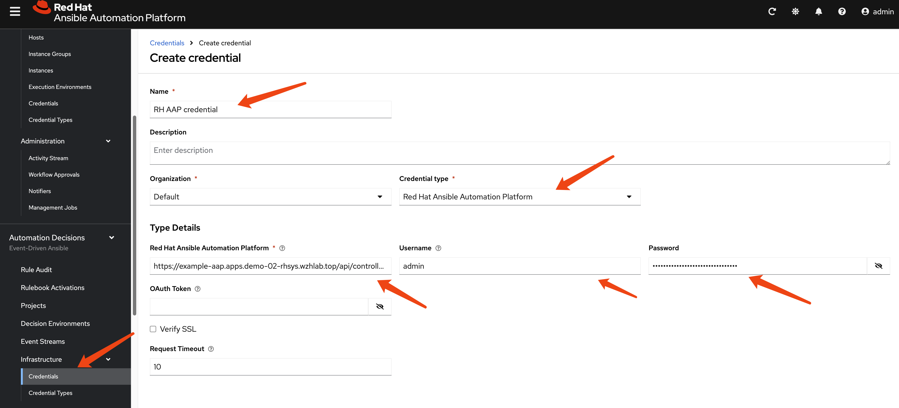

# ansible-dr-demo

## build aap de image

reference to upstream k8s eda, for aap de image build 
- https://github.com/sabre1041/sabre1041.eda/blob/main/README.md

```bash

dnf install -y python3-pip podman ansible

pip3 install ansible-builder --user

mkdir -p /data/tmp
cd /data/tmp

cat << 'EOF' > eda-de-openshift-aap25.yaml
version: 3

images:
  base_image:
    name: 'registry.redhat.io/ansible-automation-platform-25/de-supported-rhel8:latest'

dependencies:
  galaxy:
    collections:
      - ansible.eda
      - sabre1041.eda
  python_interpreter:
    package_system: "python311"
  system:
    - pkgconfig [platform:rpm]
    - systemd-devel [platform:rpm]
    - gcc [platform:rpm]
    - python3.11-devel [platform:rpm]

options:
  package_manager_path: /usr/bin/microdnf

additional_build_steps:
  append_final:
  # This is a workaround for the bug: https://issues.redhat.com/browse/AAP-32856
    - ENV PYTHONPATH=$PYTHONPATH:/usr/local/lib/python3.11/site-packages:/usr/local/lib64/python3.11/site-packages
EOF

ansible-builder build -f eda-de-openshift-aap25.yaml --container-runtime podman -v3 --squash all --prune-images -t quay.io/wangzheng422/qimgs:k8s-eda-de-openshift-aap25-2025.08.12

podman push quay.io/wangzheng422/qimgs:k8s-eda-de-openshift-aap25-2025.08.12


```

## test on linux

```bash
mkdir ~/venv
cd ~/venv
python3 -m venv eda-env

source ~/venv/eda-env/bin/activate

pip install ansible-rulebook ansible-core requests kubernetes

ansible-galaxy collection install sabre1041.eda ansible.eda

ansible-galaxy collection install -r requirements.yml

sudo dnf install -y java-17-openjdk-devel

sudo alternatives --config java

# running on a env, which `oc` can connect to ocp
ansible-rulebook --rulebook rulebooks/ocp_pv_listener_debug.yml --verbose
# 2025-08-12 07:37:06,642 - ansible_rulebook.app - INFO - Starting sources
# 2025-08-12 07:37:06,643 - ansible_rulebook.app - INFO - Starting rules
# 2025-08-12 07:37:06,643 - drools.ruleset - INFO - Using jar: /home/sno/venv/eda-env/lib/python3.9/site-packages/drools/jars/drools-ansible-rulebook-integration-runtime-1.0.7-SNAPSHOT.jar
# 2025-08-12 07:37:07 618 [main] INFO org.drools.ansible.rulebook.integration.api.rulesengine.AbstractRulesEvaluator - Start automatic pseudo clock with a tick every 100 milliseconds
# 2025-08-12 07:37:07,660 - ansible_rulebook.engine - INFO - load source sabre1041.eda.k8s
# 2025-08-12 07:37:09,451 - ansible_rulebook.engine - INFO - loading source filter eda.builtin.insert_meta_info
# 2025-08-12 07:37:09,868 - root - INFO - Running k8s eda source

# 2025-08-12 07:38:59,178 - ansible_rulebook.engine - INFO - Waiting for all ruleset tasks to end
# 2025-08-12 07:38:59,178 - ansible_rulebook.rule_set_runner - INFO - Waiting for actions on events from Listen for OCP Persistent Volume Changes (Debug)
# 2025-08-12 07:38:59,178 - ansible_rulebook.rule_set_runner - INFO - Waiting for events, ruleset: Listen for OCP Persistent Volume Changes (Debug)
# 2025-08-12 07:38:59 180 [drools-async-evaluator-thread] INFO org.drools.ansible.rulebook.integration.api.io.RuleExecutorChannel - Async channel connected
# 2025-08-12 07:38:59 181 [main] INFO org.drools.ansible.rulebook.integration.api.rulesengine.MemoryMonitorUtil - Memory occupation threshold set to 90%
# 2025-08-12 07:38:59 182 [main] INFO org.drools.ansible.rulebook.integration.api.rulesengine.MemoryMonitorUtil - Memory check event count threshold set to 64
# 2025-08-12 07:38:59 182 [main] INFO org.drools.ansible.rulebook.integration.api.rulesengine.MemoryMonitorUtil - Exit above memory occupation threshold set to false

# ** 2025-08-12 07:38:59.236078 [debug] *******************************************************************************************************************************************************
# NFS PV Created or Modified: pvc-f968a6cf-bb0c-4a13-85af-873a89d83774 (Type: ADDED)
# *********************************************************************************************************************************************************************************************

# ** 2025-08-12 07:39:00.185527 [debug] *******************************************************************************************************************************************************
# NFS PV Created or Modified: pvc-f968a6cf-bb0c-4a13-85af-873a89d83774 (Type: MODIFIED)
# *********************************************************************************************************************************************************************************************

```

## config ocp primary

```bash
# Connect your 'oc' client to the REMOTE cluster
oc create serviceaccount eda-event-reader -n default

cat << EOF > $BASE_DIR/data/install/eda-pv-event-reader.yaml
apiVersion: rbac.authorization.k8s.io/v1
kind: ClusterRole
metadata:
  name: eda-pv-event-reader
rules:
- apiGroups: [""] # Core API group
  resources: ["persistentvolumes", "persistentvolumeclaims"]
  verbs: ["get", "list", "watch", "create"]
- apiGroups: ["snapshot.storage.k8s.io"]
  resources: ["volumesnapshots", "volumesnapshotcontents"]
  verbs: ["get", "list", "watch", "create"]
EOF

oc apply -f $BASE_DIR/data/install/eda-pv-event-reader.yaml

oc create clusterrolebinding eda-pv-reader-binding \
  --clusterrole=eda-pv-event-reader \
  --serviceaccount=default:eda-event-reader

oc config view --minify -o jsonpath='{.clusters[0].cluster.server}'
# Example Output: https://api.demo-01-rhsys.wzhlab.top:6443

oc config view --raw --minify -o jsonpath='{.clusters[0].cluster.certificate-authority-data}' | base64 --decode
# This will print the full -----BEGIN CERTIFICATE-----... content.

# create token of the sa, and save to variable, expire date is 100 years
SA_TOKEN=`oc create token eda-event-reader --duration=876000h -n default`

echo $SA_TOKEN

```

## config ocp dr

```bash
# Connect your 'oc' client to the REMOTE cluster
oc create serviceaccount eda-event-reader -n default

cat << EOF > $BASE_DIR/data/install/eda-pv-event-reader.yaml
apiVersion: rbac.authorization.k8s.io/v1
kind: ClusterRole
metadata:
  name: eda-pv-event-reader
rules:
- apiGroups: [""] # Core API group
  resources: ["persistentvolumes", "persistentvolumeclaims"]
  verbs: ["get", "list", "watch", "create"]
- apiGroups: ["snapshot.storage.k8s.io"]
  resources: ["volumesnapshots", "volumesnapshotcontents"]
  verbs: ["get", "list", "watch", "create"]
EOF

oc apply -f $BASE_DIR/data/install/eda-pv-event-reader.yaml

oc create clusterrolebinding eda-pv-reader-binding \
  --clusterrole=eda-pv-event-reader \
  --serviceaccount=default:eda-event-reader

oc config view --minify -o jsonpath='{.clusters[0].cluster.server}'
# Example Output: https://api.demo-01-rhsys.wzhlab.top:6443

oc config view --raw --minify -o jsonpath='{.clusters[0].cluster.certificate-authority-data}' | base64 --decode
# This will print the full -----BEGIN CERTIFICATE-----... content.

# create token of the sa, and save to variable, expire date is 100 years
SA_TOKEN=`oc create token eda-event-reader --duration=876000h -n default`

echo $SA_TOKEN


```

## config app


