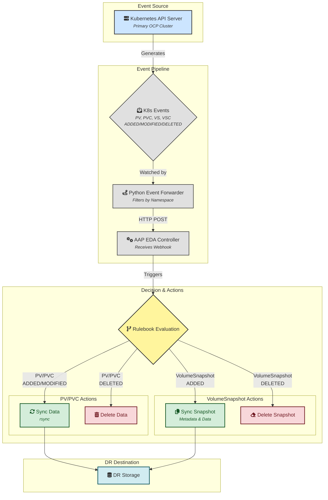
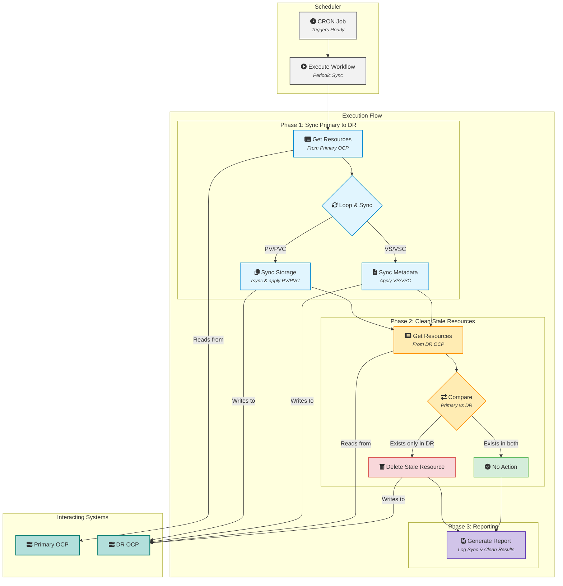
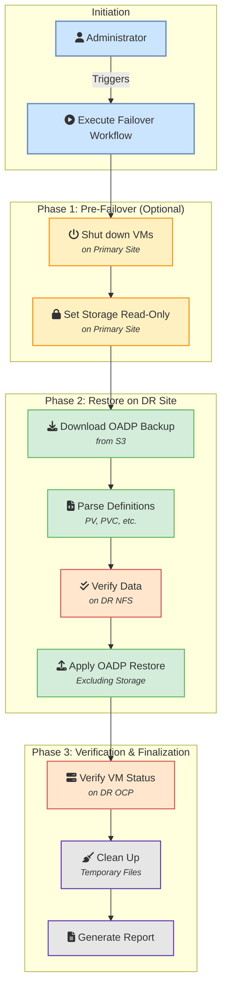

### Project Name: OCP-V Event-Driven Disaster Recovery Automation Project

### **1. Project Goals and Three-Mode Architecture**

**Goal:**
This project aims to build a three-mode, highly automated OCP-V disaster recovery solution. It combines event-driven real-time synchronization, periodic proactive validation, and manually triggered disaster recovery capabilities to achieve near-real-time data synchronization, eventual consistency assurance, and one-click disaster recovery failover.

**Three-Mode Architecture:**

1.  **Mode One: Event-Driven Replication**
    *   **Core**: AAP Event-Driven Ansible (EDA) Controller.
    *   **Objective**: To automatically and in real-time synchronize underlying storage data and related metadata to the disaster recovery site by listening for PV (PersistentVolume), PVC (PersistentVolumeClaim), VolumeSnapshot, and VolumeSnapshotContent events within specified namespaces in the primary OpenShift cluster. This mode offers the fastest response and is the primary means of data synchronization.
2.  **Mode Two: Scheduled Proactive Sync**
    *   **Core**: AAP Workflow Scheduler.
    *   **Objective**: To periodically (e.g., hourly) perform a comprehensive scan and synchronization of all PVs, PVCs, VolumeSnapshots, and VolumeSnapshotContents within specified namespaces at the primary site. This serves as a supplement and validation to the event-driven mode, ensuring eventual data consistency and preventing data discrepancies due to lost events. **Additionally, this mode compares resources between the primary and DR sites and deletes resources that exist on the DR site but have been deleted from the primary site, ensuring an exact mirror of the DR environment.**
3.  **Mode Three: Manual Failover**
    *   **Core**: AAP Workflow.
    *   **Objective**: In the event of a disaster, an administrator manually triggers a standardized workflow to rebuild storage and restore application services at the disaster recovery site.

### **2. Core Concepts and Automation Architecture**

**Automation Architecture Diagram:**

**Mode One: Event-Driven Replication**


**Mode Two: Scheduled Proactive Sync**


**Mode Three: Manual Failover**


### **3. Ansible Project Structure Design (Architecture Update)**

To support multiple `StorageClass` types and decouple the processing logic for PV/PVC from VolumeSnapshot, the project structure is updated as follows:

```
ocp-v-dr-automation/
├── inventory/
│   └── hosts.ini
├── group_vars/
│   └── all.yml
├── rulebooks/
│   └── ocp_dr_events.yml         # EDA rulebook, listens for all events
├── roles/
│   ├── event_pv_pvc_sync/        # Role: (Event-Driven) Handles PV/PVC creation/update
│   │   └── tasks/
│   │       ├── main.yml          # -> Dispatches based on storageClassName
│   │       ├── handle_nfs_subdir.yml
│   │       ├── handle_nfs_dynamic.yml
│   │       └── handle_nfs_csi.yml
│   ├── event_pv_pvc_delete/      # Role: (Event-Driven) Handles PV/PVC deletion
│   │   └── tasks/
│   │       ├── main.yml          # -> Dispatches based on storageClassName
│   │       ├── handle_nfs_subdir.yml
│   │       ├── handle_nfs_dynamic.yml
│   │       └── handle_nfs_csi.yml
│   ├── event_snapshot_sync/      # Role: (Event-Driven) Handles snapshot creation/update
│   ├── event_snapshot_delete/    # Role: (Event-Driven) Handles snapshot deletion
│   │
│   ├── periodic_pv_pvc_sync/     # Role: (Periodic Sync) Syncs PV/PVC
│   │   └── tasks/
│   │       ├── main.yml          # -> Iterates and dispatches based on storageClassName
│   │       ├── sync_nfs_subdir.yml
│   │       ├── sync_nfs_dynamic.yml
│   │       └── sync_nfs_csi.yml
│   ├── periodic_snapshot_sync/   # Role: (Periodic Sync) Syncs snapshots
│   │
│   ├── oadp_backup_parser/       # Role: (For DR) Parses OADP backups
│   ├── dr_storage_provisioner/   # Role: (For DR) Deploys PV/PVC on DR cluster (on-demand)
│   └── oadp_restore_trigger/     # Role: (For DR) Executes OADP restore
│
└── playbooks/
    ├── event_driven/
    │   ├── handle_pv_pvc_sync.yml    # Playbook: (EDA) Calls event_pv_pvc_sync
    │   ├── handle_pv_pvc_delete.yml  # Playbook: (EDA) Calls event_pv_pvc_delete
    │   ├── handle_snapshot_sync.yml  # Playbook: (EDA) Calls event_snapshot_sync
    │   └── handle_snapshot_delete.yml# Playbook: (EDA) Calls event_snapshot_delete
    │
    ├── manual_dr/
    │   └── execute_failover.yml      # Playbook: (For DR) Executes a complete failover
    │
    └── scheduled/
        └── execute_periodic_sync.yml # Playbook: (Periodic) Calls periodic_pv_pvc_sync and periodic_snapshot_sync in sequence
```
### **4. Mode One: Event-Driven Data Replication Logic Explained**

#### 4.1 OCP Event Forwarding and Webhook Trigger

*   **Implementation**: Achieved on the primary OpenShift cluster via a custom **Python Event Forwarder (k8s_event_forwarder.py)**.
    *   The forwarder runs as a Deployment within the cluster, using an `in-cluster` Service Account for authentication.
    *   The container image is built based on Red Hat UBI 8 (`registry.access.redhat.com/ubi8/python-39`), ensuring environment stability and security.
    *   **Configurable Namespaces**: The forwarder is configured with a list of namespaces to monitor via the `WATCH_NAMESPACES` environment variable. If the list is empty, it monitors all namespaces.
    *   It uses the `watch` feature of the `kubernetes` Python client to simultaneously monitor four types of resources:
        *   `PersistentVolume` (not namespaced)
        *   `PersistentVolumeClaim` (namespaced)
        *   `VolumeSnapshot` (namespaced)
        *   `VolumeSnapshotContent` (not namespaced)
    *   When an `ADDED`, `MODIFIED`, or `DELETED` event is captured, for namespaced resources, it checks if the resource belongs to a monitored namespace. If it matches, it wraps the event into a unified JSON payload (including the resource's `namespace` info) and sends it via an HTTP POST request to the Webhook URL configured on the AAP EDA Controller.
*   **Trigger Conditions**:
    *   **PersistentVolume**: Listens for all events on `v1.PersistentVolume` resources.
    *   **PersistentVolumeClaim**: Listens for events on `v1.PersistentVolumeClaim` resources in specified namespaces.
    *   **VolumeSnapshot**: Listens for events on `VolumeSnapshot` resources in the `snapshot.storage.k8s.io/v1` group in specified namespaces.
    *   **VolumeSnapshotContent**: Listens for events on `VolumeSnapshotContent` resources in the `snapshot.storage.k8s.io/v1` group.

#### 4.2 AAP EDA Rulebook and Logic Distribution

*   **File**: `rulebooks/ocp_dr_events.yml`
*   **Logic Design**:
    This rulebook listens for HTTP POST requests from the OCP event forwarder via `ansible.eda.webhook`. It defines a series of rules to trigger different AAP job templates based on the event type (`ADDED`, `MODIFIED`, `DELETED`) and resource type (`PersistentVolume`, `PersistentVolumeClaim`, `VolumeSnapshot`, `VolumeSnapshotContent`).
    - **Core Variable**: `watched_namespaces` is used to define the list of namespaces to monitor.
    - **Rule Categorization**:
        - **Non-namespaced resources (PV, VSC)**: Directly handle their create, modify, and delete events.
        - **Namespaced resources (PVC, VS)**: Before processing an event, check if the resource's namespace is in the `watched_namespaces` list.
    - **Trigger Action**: When a rule matches, it calls the `run_job_template` action, passing the resource object from the event (`event.resource`) as `extra_vars` to the corresponding AAP job template (e.g., "EDA - Sync PV to DR" or "EDA - Delete PVC from DR"), thus starting the subsequent sync or cleanup process.
    - **Special Handling for Snapshots**: For `VolumeSnapshot` creation events, the rule adds a condition to check `status.readyToUse == true`, ensuring the sync is triggered only when the snapshot is available.
*   **Corresponding Playbooks and Roles**:
    *   **Logic Separation**: The playbook layer now strictly separates PV/PVC events from VolumeSnapshot events, calling different dedicated playbooks.
    *   **playbooks/event_driven/handle_pv_pvc_sync.yml**:
        1.  Receives the `resource_object` (PV or PVC) passed from AAP EDA.
        2.  Calls the `event_pv_pvc_sync` role for processing.
        3.  **Role Logic (`event_pv_pvc_sync`)**:
            *   **Core**: The `main.yml` within the role checks `resource_object.spec.storageClassName`.
            *   Uses `include_tasks` or a similar mechanism to call the corresponding handler file (e.g., `handle_nfs_subdir.yml`) based on the `storageClassName` (e.g., `nfs-subdir`, `nfs-dynamic`, `nfs-csi`).
            *   The specific handler file is responsible for executing data synchronization (like `rsync`) and metadata processing for that storage type.
    *   **playbooks/event_driven/handle_pv_pvc_delete.yml**:
        1.  Receives the `resource_object`.
        2.  Calls the `event_pv_pvc_delete` role.
        3.  **Role Logic (`event_pv_pvc_delete`)**: Also dispatches based on `storageClassName` to perform storage-specific cleanup operations.
    *   **playbooks/event_driven/handle_snapshot_sync.yml**:
        1.  Receives the `resource_object` (VolumeSnapshot or VolumeSnapshotContent).
        2.  Calls the `event_snapshot_sync` role, which is responsible for syncing snapshot metadata.
    *   **playbooks/event_driven/handle_snapshot_delete.yml**:
        1.  Receives the `resource_object`.
        2.  Calls the `event_snapshot_delete` role, responsible for cleaning up snapshot metadata.

### **5. Mode Two: Periodic Proactive Sync Logic Explained**

This process is triggered periodically by the AAP Scheduler, serving as a supplement and validation for the event-driven mode. **Following the architecture update, the sync logic for PV/PVC is separated from the VolumeSnapshot sync logic into different roles for better modularity and extensibility.**

*   **Playbook**: `playbooks/scheduled/execute_periodic_sync.yml`
*   **Core Roles**: `roles/periodic_pv_pvc_sync`, `roles/periodic_snapshot_sync`
*   **Key Variable**: The playbook should specify the namespaces to sync via the `target_namespaces` variable (e.g., `['ns1', 'ns2']`).

#### 5.1 Get All Relevant Resources
*   This step remains unchanged. The playbook first connects to the primary OpenShift cluster (`ocp_primary`).
*   Using the `k8s_info` module, it gets lists of all `PersistentVolumeClaim` and `VolumeSnapshot` in the `target_namespaces`.
*   It also gets lists of all related `PersistentVolume` and `VolumeSnapshotContent`.

#### 5.2 Periodic Sync of PVC/PV (Warm Standby)
*   **Playbook Logic**: The main playbook (`execute_periodic_sync.yml`) calls the `periodic_pv_pvc_sync` role, passing the retrieved PV and PVC lists as parameters.
*   **Role Logic (`periodic_pv_pvc_sync`)**:
    *   **Input**: `all_pvs` and `all_pvcs` lists.
    *   **Iteration**: The role loops through all PVCs that need to be synced.
    *   **Core: Storage Logic Dispatch**:
        *   For each PVC, the role checks the `spec.storageClassName` of its associated PV.
        *   Based on the `storageClassName`, it uses `include_tasks` to call the sync logic file specific to that storage type (e.g., `sync_nfs_subdir.yml`, `sync_nfs_dynamic.yml`, `sync_nfs_csi.yml`).
    *   **Specific Storage Logic (e.g., `sync_nfs_*.yml`)**:
        1.  **Data Sync**: `delegate_to` the primary storage server to execute `rsync` to sync data to the DR storage server.
        2.  **Modify PV Definition**: In memory, modify the PV definition to point to the DR storage server's path and address. Also, forcibly set `persistentVolumeReclaimPolicy` to `Retain`.
        3.  **Clean Metadata**: Before applying to the DR cluster, clean source-cluster-specific metadata from the PV and PVC objects (like `resourceVersion`, `uid`, `claimRef`, etc.).
        4.  **Apply to DR Cluster**: Use the `kubernetes.core.k8s` module to `apply` the cleaned and modified PV and PVC definitions to the DR cluster.
    *   **Log Status**: Record the sync status of each PV and PVC.

#### 5.3 Periodic Sync of VolumeSnapshot/VolumeSnapshotContent
*   **Playbook Logic**: After the PV/PVC sync is complete, the main playbook calls the `periodic_snapshot_sync` role, passing the retrieved VolumeSnapshot and VolumeSnapshotContent lists as parameters.
*   **Role Logic (`periodic_snapshot_sync`)**:
    *   **Input**: `all_snapshots` and `all_snapshot_contents` lists.
    *   **Iteration**: The role loops through all `readyToUse` VolumeSnapshots.
    *   **Metadata Sync**:
        1.  **Clean Metadata**: Clean source-cluster-specific metadata from the VolumeSnapshot and VolumeSnapshotContent objects.
        2.  **Apply to DR Cluster**: Use the `kubernetes.core.k8s` module to `apply` the cleaned definitions to the DR cluster.
    *   **Data Sync Note**: This role focuses on metadata synchronization. The underlying snapshot data is assumed to be handled by storage-level replication or custom logic with `rsync`.

#### 5.4 Clean Stale Resources on DR Site
*   This logic is executed at the end of the main playbook and remains unchanged.
*   It fetches the lists of PV/PVC and VolumeSnapshot/VSC from the DR site.
*   It compares them with the resource lists from the primary site and deletes any extra resources found on the DR site.

#### 5.5 Generate Report
*   This step remains unchanged, summarizing all operation results at the end of the playbook and generating a report.

### **6. Mode Three: Manual Disaster Recovery Logic Explained**

This process is manually initiated by an administrator via an AAP Workflow Template after a disaster occurs.

#### 6.1 Pre-Failover Actions (Primary Site)

*   **Objective**: Ensure data consistency and prepare for disaster recovery during a primary site failure or planned switchover.
*   **Implementation**: As initial steps in the `manual_dr/execute_failover.yml` playbook.
*   **Roles/Tasks**:
    1.  **Shut down relevant VMs on the primary site**:
        *   Connect to the primary OpenShift cluster (ocp_primary).
        *   Identify all virtual machines in the protected namespaces.
        *   Execute `oc delete vm <vm-name> -n <namespace>` or `oc patch vm <vm-name> -p '{"spec":{"running":false}}' --type=merge` to shut down the VMs.
    2.  **(Optional) Set primary storage to read-only**:
        *   For NFS scenarios, connect to the primary NFS server.
        *   Modify the NFS export configuration to set the relevant paths to read-only, preventing further writes.
        *   **Note**: This step needs to be adjusted based on the actual storage type and automation capabilities.

#### 6.2 Find and Parse Backup

*   **Role: oadp_backup_parser**
    1.  **Input**: The `backup_name` to restore (provided by an AAP Survey; if empty, finds the latest) and `namespace`.
    2.  Executes on `localhost`.
    3.  Downloads the specified OADP backup package from S3.
    4.  Unzips and parses it, extracting all PV, PVC, VolumeSnapshot, and VolumeSnapshotContent JSON definitions into `pv_info_list`, `pvc_info_list`, `vs_info_list`, and `vsc_info_list` variables.
    5.  **Output**: List variables containing all parsed resource definitions.

#### 6.3 Storage Logic Dispatch and Validation

*   **Playbook Internal Logic**:
    1.  **Input**: The `pv_info_list` from the `oadp_backup_parser` role.
    2.  **Core: Storage Logic Dispatch**: The playbook iterates through the `pv_info_list`. For each PV object in the list, it checks `item.spec.storageClassName`.
    3.  **Dynamic Task Inclusion**: Based on the `storageClassName`, the playbook dynamically `include_tasks` a validation task file specific to that storage type. For example, if `storageClassName` is `nfs-dynamic`, it will call `verify_nfs_dynamic.yml`. There will be a corresponding `verify_nfs_csi.yml` for `nfs-csi`.
    4.  **Specific Storage Validation (NFS Example)**:
        *   **Objective**: Verify that the data on the DR side is ready.
        *   **Action**: `delegate_to` the DR NFS server (`dr_nfs_server`).
        *   Based on the path information in the PV definition, check if the corresponding directory exists and is not empty on the DR NFS server.
        *   This is a verification step, not a synchronization. If verification fails, it will log a critical warning or abort the process, indicating a problem with the periodic sync and that the DR data is unreliable.

#### 6.4 Restore Applications on DR OCP

*   **Role: oadp_restore_trigger**
    1.  **Input**: `backup_name`.
    2.  Connects to the DR OCP cluster (`ocp_dr`).
    3.  Dynamically generates a Restore object, setting `spec.backupName` to the input `backup_name`, and `excludedResources` must include `persistentvolumes`, `persistentvolumeclaims`, `volumesnapshots`, `volumesnapshotcontents`.
    4.  `apply` this Restore object and poll the VM status until successful.

#### 6.5 Post-Disaster Recovery Validation and Cleanup

*   **Objective**: Confirm successful disaster recovery and perform necessary cleanup tasks.
*   **Implementation**: As subsequent steps in the `manual_dr/execute_failover.yml` playbook.
*   **Roles/Tasks**:
    1.  **Verify VM Status**:
        *   Connect to the DR OpenShift cluster (`ocp_dr`).
        *   Check if the restored virtual machines are in the `Running` state.
        *   Attempt to connect inside the VMs to verify that application services have started correctly.
    2.  **Clean Up Temporary Files**:
        *   Delete the temporary backup files downloaded and unzipped by the `oadp_backup_parser` role.
    3.  **Generate Report**:
        *   Record the time of the failover, its duration, success or failure status, and any critical information.

### **7. AAP Platform Configuration**

1.  **EDA Controller Configuration**:
    *   Create a Project pointing to the Git repository containing the `rulebooks/` directory.
    *   Configure a Decision Environment (usually the default one).
    *   Create a Rulebook Activation, associate it with the project and the `ocp_dr_events.yml` rulebook, and enable it.
    *   **Important**: In the Rulebook Activation, the Webhook URL and authentication Token must be passed as environment variables to the `k8s_event_forwarder.py` Deployment.
2.  **Workflow and Scheduling Configuration**:
    *   **Event-Driven Job Templates**: Create Job Templates for the playbooks triggered by EDA, such as `handle_nfs_pv_sync.yml`, `handle_nfs_pv_delete.yml`, etc.
    *   **Periodic Sync Job Template**: Create a Job Template associated with the `scheduled/execute_periodic_sync.yml` playbook.
        *   Configure a **Schedule** on this Job Template with a CRON expression (e.g., `0 * * * *` for hourly execution).
    *   **Manual Recovery Workflow Template**: Create a "One-Click Failover" Workflow Template, associate it with the `manual_dr/execute_failover.yml` playbook, and configure a survey to receive the `backup_name`.

With this design, your disaster recovery solution will be elevated to a new level, achieving automated and real-time data synchronization, ensuring eventual consistency through periodic validation, while maintaining the rigor and controllability of the disaster recovery process.
