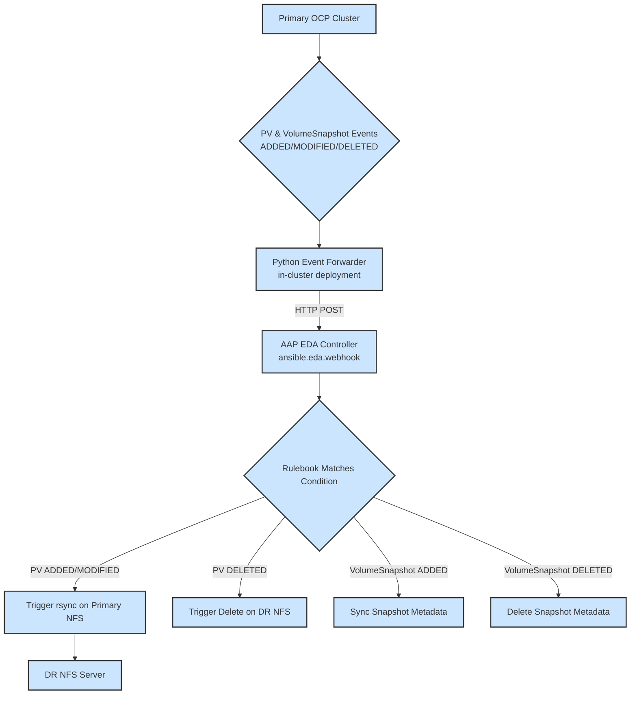
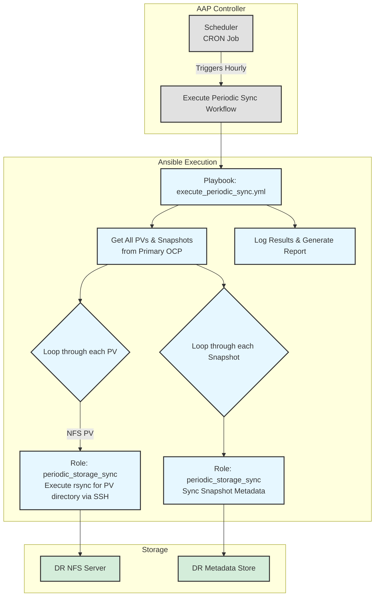
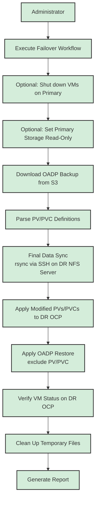

### Project Name: OCP-V Event-Driven Disaster Recovery Automation Project

### **1. Project Goals and Three-Mode Architecture**

Goal:
This project aims to build a three-mode, highly automated OCP-V disaster recovery solution. It combines event-driven real-time synchronization, periodic proactive validation, and manually triggered disaster recovery capabilities to achieve near real-time data synchronization, eventual consistency assurance, and one-click disaster recovery failover.
**Three-Mode Architecture:**

1.  **Mode One: Event-Driven Real-time Data Replication**
    *   **Core**: AAP Event-Driven Ansible (EDA) Controller.
    *   **Objective**: Automatically and in real-time synchronize underlying storage data to the disaster recovery site by listening for PV (PersistentVolume) events in the primary OpenShift cluster. This mode has the fastest response speed and is the primary means of data synchronization.
2.  **Mode Two: Scheduled Proactive Sync**
    *   **Core**: AAP Workflow Scheduler.
    *   **Objective**: Periodically (e.g., hourly) perform a comprehensive scan and synchronization of all PVs and VolumeSnapshots from the primary site, serving as a supplement and validation to the event-driven mode, ensuring eventual data consistency and preventing data discrepancies due to lost events.
3.  **Mode Three: Manual Failover**
    *   **Core**: AAP Workflow.
    *   **Objective**: In the event of a disaster, an administrator manually triggers a standardized workflow to recreate storage and restore application services at the disaster recovery site.

### **2. Core Concepts and Automation Architecture**

**Automation Architecture Diagram:**

**Mode One: Event-Driven Real-time Replication**


**Mode Two: Scheduled Proactive Sync**


**Mode Three: Manual Failover**


### **3. Ansible Project Structure Design (Integrated with EDA)**
```
ocp-v-dr-automation/
├── inventory/
│   └── hosts.ini                 # Host inventory
├── group_vars/
│   ├── all.yml
│   └── ...
├── rulebooks/
│   └── ocp_dr_events.yml         # EDA Rulebook, listens for PV and Snapshot events
├── roles/
│   ├── nfs_sync_on_event/        # Role: Responds to PV create/modify events, executes rsync
│   ├── nfs_delete_on_event/      # Role: Responds to PV delete events, deletes remote directory
│   ├── snapshot_sync_on_event/   # Role: Responds to Snapshot create events, synchronizes metadata
│   ├── snapshot_delete_on_event/ # Role: Responds to Snapshot delete events, cleans up metadata
│   ├── oadp_backup_parser/       # Role: (For DR) Parses OADP backups
│   ├── dr_storage_provisioner/   # Role: (For DR) Deploys PV/PVC in DR cluster
│   ├── oadp_restore_trigger/     # Role: (For DR) Executes OADP restore
│   └── periodic_storage_sync/    # Role: (For periodic tasks) Iterates and synchronizes all storage resources
└── playbooks/
    ├── event_driven/
    │   ├── handle_nfs_pv_sync.yml    # Playbook: (For EDA) Calls nfs_sync_on_event
    │   ├── handle_nfs_pv_delete.yml  # Playbook: (For EDA) Calls nfs_delete_on_event
    │   ├── handle_snapshot_sync.yml  # Playbook: (For EDA) Calls snapshot_sync_on_event
    │   └── handle_snapshot_delete.yml# Playbook: (For EDA) Calls snapshot_delete_on_event
    ├── manual_dr/
    │   └── execute_failover.yml      # Playbook: (For DR) Executes complete disaster recovery failover
    └── scheduled/
        └── execute_periodic_sync.yml # Playbook: (For periodic tasks) Executes complete periodic synchronization
```
### **4. Mode One: Event-Driven Data Replication Logic Explained**

#### Process 1-2: OCP Event Forwarding and Webhook Trigger

*   **Implementation**: Achieved on the primary OpenShift cluster through a custom **Python Event Forwarder (k8s_event_forwarder.py)**.
    *   This forwarder runs as a Deployment within the cluster, using an `in-cluster` Service Account for authentication.
    *   It uses the `watch` feature of the `kubernetes` Python client to simultaneously monitor `PersistentVolume` and `VolumeSnapshot` resources.
    *   When `ADDED`, `MODIFIED`, or `DELETED` events for resources are captured, it encapsulates the event into a unified JSON payload and sends it via an HTTP POST request to the Webhook address configured on the AAP EDA Controller.
*   **Trigger Conditions**:
    *   **PersistentVolume**: Listens for all events on `v1.PersistentVolume` resources.
    *   **VolumeSnapshot**: Listens for all events on `VolumeSnapshot` resources under the `snapshot.storage.k8s.io/v1` group.

#### Process 3-4: AAP EDA Rulebook and Logic Distribution

*   **File**: rulebooks/ocp_dr_events.yml
*   **Logic Design**:
```yaml
---
- name: Process OCP DR Events from Webhook
  hosts: localhost
  sources:
    - ansible.eda.webhook:
        host: 0.0.0.0
        port: 5000
        # In AAP, a token needs to be configured to protect this webhook
        # token: "{{ eda_webhook_token }}"

  rules:
    # Rule 1: Handle NFS PV creation and modification
    - name: Handle NFS PV Create or Update
      condition: >
        event.kind == "PersistentVolume" and
        (event.type == "ADDED" or event.type == "MODIFIED") and
        event.resource.spec.storageClassName == "nfs-dynamic"
      action:
        run_job_template:
          name: "EDA - Sync NFS PV to DR"
          organization: "Default"
          job_args:
            extra_vars:
              pv_object: "{{ event.resource }}" # Complete PV object encapsulated by the forwarder

    # Rule 2: Handle NFS PV deletion
    - name: Handle NFS PV Deletion
      condition: >
        event.kind == "PersistentVolume" and
        event.type == "DELETED" and
        event.resource.spec.storageClassName == "nfs-dynamic"
      action:
        run_job_template:
          name: "EDA - Delete NFS PV from DR"
          organization: "Default"
          job_args:
            extra_vars:
              pv_object: "{{ event.resource }}"

    # Rule 3: Handle VolumeSnapshot creation
    - name: Handle VolumeSnapshot Creation
      condition: >
        event.kind == "VolumeSnapshot" and
        event.type == "ADDED" and
        event.resource.status.readyToUse == true
      action:
        run_job_template:
          name: "EDA - Sync VolumeSnapshot Metadata"
          organization: "Default"
          job_args:
            extra_vars:
              snapshot_object: "{{ event.resource }}"

    # Rule 4: Handle VolumeSnapshot deletion
    - name: Handle VolumeSnapshot Deletion
      condition: >
        event.kind == "VolumeSnapshot" and
        event.type == "DELETED"
      action:
        run_job_template:
          name: "EDA - Delete VolumeSnapshot Metadata"
          organization: "Default"
          job_args:
            extra_vars:
              snapshot_object: "{{ event.resource }}"
```
*   **Corresponding Playbooks**:
    *   **playbooks/event_driven/handle_nfs_pv_sync.yml**:
        1.  Receives the `pv_object` variable passed from AAP EDA.
        2.  Calls the `nfs_sync_on_event` role.
        3.  Role logic: Only debugs the incoming `pv_object` variable. All path construction and `rsync` logic are commented out.
    *   **playbooks/event_driven/handle_nfs_pv_delete.yml**:
        1.  Receives the `pv_object` variable.
        2.  Calls the `nfs_delete_on_event` role.
        3.  Role logic: Only debugs the incoming `pv_object` variable. All path construction and `rsync` logic are commented out.
    *   **playbooks/event_driven/handle_snapshot_sync.yml**:
        1.  Receives the `snapshot_object` variable.
        2.  Calls the `snapshot_sync_on_event` role.
        3.  Role logic: Parses snapshot metadata, may need to record snapshot information or trigger other related operations at the DR site.
    *   **playbooks/event_driven/handle_snapshot_delete.yml**:
        1.  Receives the `snapshot_object` variable.
        2.  Calls the `snapshot_delete_on_event` role.
        3.  Role logic: Cleans up corresponding records or resources at the DR site based on snapshot metadata.

### **5. Mode Two: Periodic Proactive Sync Logic Explained**

This process is triggered periodically by AAP's scheduling function (Scheduler), for example, once an hour, as a supplement and validation to the event-driven mode.

*   **Playbook**: `playbooks/scheduled/execute_periodic_sync.yml`
*   **Core Role**: `roles/periodic_storage_sync`

#### **Process Details**:

1.  **Retrieve all relevant resources**:
    *   Connect to the primary OpenShift cluster (`ocp_primary`).
    *   Use the `k8s_info` module to get a list of all `PersistentVolume` with `storageClassName` as `nfs-dynamic`.
    *   Use the `k8s_info` module to get a list of all `VolumeSnapshot`.

2.  **Iterate and synchronize PVs**:
    *   In the Playbook, use a `loop` to iterate through the retrieved PV list.
    *   For each PV, call the `periodic_storage_sync` role.
    *   **Role Logic (`periodic_storage_sync`)**:
        *   **Input**: A single `pv_object`.
        *   **Construct Path**: Extract the source path from `pv_object.spec.nfs.path`. The destination path can be generated on the DR NFS server based on the source path.
        *   **Execute Sync**: `delegate_to` the DR NFS server (`dr_nfs_server`), execute the `rsync -av --delete` command to ensure the DR side is completely consistent with the primary site's directory.
        *   **Log Results**: Record the synchronization status of each PV (success, failure, discrepancy).

3.  **Iterate and synchronize VolumeSnapshots**:
    *   Similarly, use a `loop` to iterate through the retrieved `VolumeSnapshot` list.
    *   For each snapshot, call the `periodic_storage_sync` role (or a dedicated role for snapshots).
    *   **Role Logic**:
        *   **Input**: A single `snapshot_object`.
        *   **Synchronize Metadata**: Ensure that the snapshot's metadata (e.g., creation time, associated PV, etc.) is up-to-date in the DR site's record library.
        *   **(Optional) Synchronize Snapshot Data**: If the underlying storage supports snapshot-based incremental synchronization, trigger the corresponding synchronization command. For NFS, this usually means synchronizing the specific data directory associated with the snapshot.

4.  **Generate Report**:
    *   At the end of the Playbook, summarize the synchronization results for all resources.
    *   Generate a concise report indicating which resources were synchronized successfully, which failed, and any data inconsistencies found. This report can be notified to administrators via email, Webhook, etc.

### **6. Mode Three: Manual Disaster Recovery Logic Explained**

This process is manually initiated by an administrator after a disaster, by launching a Workflow Template in AAP.

#### Process 0: Pre-failover Operations (Primary Site)

*   **Objective**: In case of primary site failure or planned failover, ensure data consistency and prepare for disaster recovery.
*   **Implementation**: As an initial step in the `manual_dr/execute_failover.yml` Playbook.
*   **Roles/Tasks**:
    1.  **Shut down relevant VMs on the primary site**:
        *   Connect to the primary OpenShift cluster (ocp\_primary).
        *   Identify all virtual machines in the namespaces to be protected.
        *   Execute `oc delete vm <vm-name> -n <namespace>` or `oc patch vm <vm-name> -p '{"spec":{"running":false}}' --type=merge` to shut down the virtual machines.
    2.  **(Optional) Set primary storage to read-only**:
        *   For NFS scenarios, connect to the primary NFS server.
        *   Modify the NFS export configuration to set relevant paths to read-only, preventing further writes.
        *   **Note**: This step needs to be adjusted based on the actual storage type and automation capabilities.
    3.  **Verify data synchronization status**:
        *   Although EDA aims for real-time synchronization, before failover, perform a final data consistency check (e.g., for NFS, check the size or number of files in source and target directories, optionally based on checksum verification).

#### Process 1-3: Find and Parse Backup

*   **Role: oadp_backup_parser**
    1.  **Input**: `backup_name` provided by AAP Survey (if empty, automatically find the latest).
    2.  Execute on `localhost`.
    3.  Download the specified OADP backup package from S3.
    4.  Decompress and parse, extracting all PV and PVC JSON definitions, forming `pv_info_list` and `pvc_info_list` variables.
    5.  **Output**: `pv_info_list` and `pvc_info_list` variables.

#### Process 4-5: Storage Logic Distribution and Validation (NFS Scenario)

*   **Playbook Internal Logic**:
    1.  **Input**: `pv_info_list` output from the previous step.
    2.  **Logic Distribution**: Use `when` conditions or `include_role`'s `when` clause to decide which storage type's validation logic to execute based on `item.spec.storageClassName`.
    3.  **NFS Validation**: **On the DR site's NFS server (`delegate_to: dr_nfs_server`)** perform final data synchronization. Based on the path information in `pv_info_list`, construct an `rsync` command to pull data from the primary NFS server to the DR NFS server. This is a critical step to ensure eventual data consistency.
        *   **Command Example**: `rsync -av --delete user@primary-nfs:/path/to/data/ /path/to/dr/data/`
        *   Before performing the actual restore, you can first run `rsync --dry-run` for a check, and if inconsistencies are found, a warning message can be printed.

#### Process 6: Deploy Storage on DR OCP

*   **Role: dr_storage_provisioner**
    1.  **Input**: `pv_info_list` and `pvc_info_list`.
    2.  Connect to the DR OCP cluster (`ocp_dr`).
    3.  Loop through `pv_info_list`, dynamically generate new PV definitions. **Key Modification**: Update `spec.nfs.server` to the DR NFS server IP, and adjust `spec.nfs.path` according to the DR site's storage layout. Then `apply` the modified PV definitions to the DR cluster.
    4.  Loop through `pvc_info_list` and `apply` them to the DR cluster.

#### 7. Restore Applications on DR OCP

*   **Role: oadp_restore_trigger**
    1.  **Input**: `backup_name`.
    2.  Connect to the DR OCP cluster (`ocp_dr`).
    3.  Dynamically generate a Restore object, set `spec.backupName` to the input `backup_name`, and `excludedResources` must include `persistentvolumes` and `persistentvolumeclaims`.
    4.  `apply` this Restore object and poll VM status until successful.

#### 8. Post-Disaster Recovery Validation and Cleanup

*   **Objective**: Confirm successful disaster recovery and perform necessary cleanup.
*   **Implementation**: As subsequent steps in the `manual_dr/execute_failover.yml` Playbook.
*   **Roles/Tasks**:
    1.  **Verify VM Status**:
        *   Connect to the DR OpenShift cluster (`ocp_dr`).
        *   Check if the restored virtual machines are in `Running` status.
        *   Attempt to connect inside the virtual machines to verify if application services have started normally.
    2.  **Clean up temporary files**:
        *   Delete temporary backup files downloaded and decompressed by the `oadp_backup_parser` role.
    3.  **Generate Report**:
        *   Record the failover time, duration, success or failure status, and any critical information.

### **7. AAP Platform Configuration**

1.  **EDA Controller Configuration**:
    *   Create a Project pointing to the Git repository containing the `rulebooks/` directory.
    *   Configure a Decision Environment (usually using the default).
    *   Create a Rulebook Activation, associate it with the Project and the `ocp_dr_events.yml` rulebook, and start it.
    *   **Important**: In the Rulebook Activation, the Webhook URL and authentication Token need to be passed as environment variables to the `k8s_event_forwarder.py` Deployment.
2.  **Workflow and Schedule Configuration**:
    *   **Event-Driven Job Templates**: Create Job Templates corresponding to the Playbooks triggered by EDA, such as `handle_nfs_pv_sync.yml`, `handle_nfs_pv_delete.yml`, etc.
    *   **Periodic Sync Job Template**: Create a Job Template associated with the `scheduled/execute_periodic_sync.yml` Playbook.
        *   Configure a **Schedule** on this Job Template, setting a CRON expression (e.g., `0 * * * *` for hourly execution).
    *   **Manual Recovery Workflow Template**: Create a "One-Click Disaster Recovery Failover" Workflow Template, associate it with the `manual_dr/execute_failover.yml` Playbook, and configure a survey to receive `backup_name`.

With this design, your disaster recovery solution will be elevated to a new level, achieving automated and real-time data synchronization, ensuring eventual consistency through periodic validation, while maintaining the rigor and controllability of the disaster recovery process.
