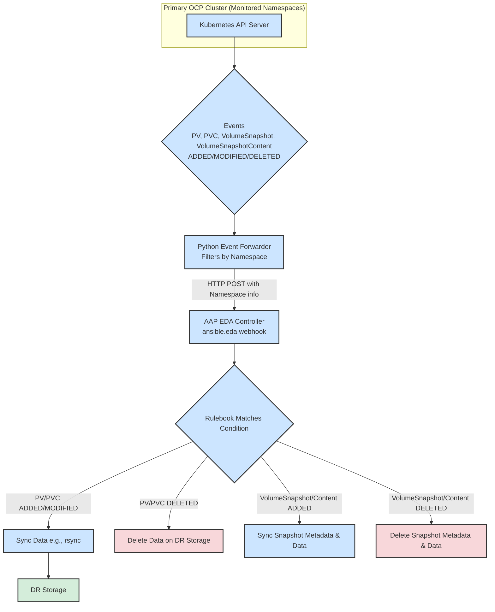
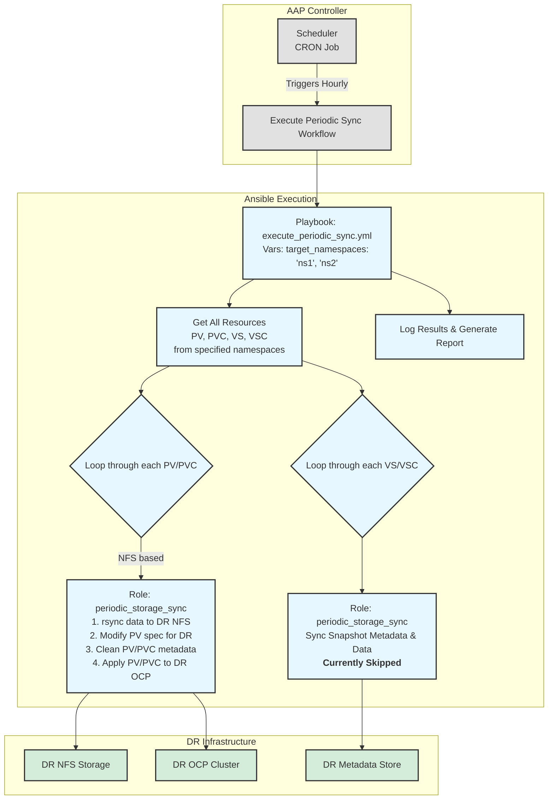
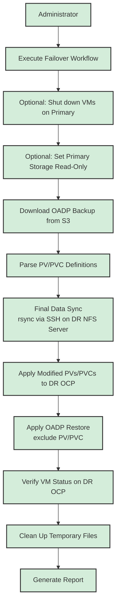

### Project Name: OCP-V Event-Driven Disaster Recovery Automation Project

### **1. Project Goals and Three-Mode Architecture**

**Goal:**
This project aims to build a three-mode, highly automated OCP-V disaster recovery solution. It combines event-driven real-time synchronization, periodic proactive validation, and manually triggered disaster recovery capabilities to achieve near-real-time data synchronization, eventual consistency assurance, and one-click disaster recovery failover.

**Three-Mode Architecture:**

1.  **Mode One: Event-Driven Replication**
    *   **Core**: AAP Event-Driven Ansible (EDA) Controller.
    *   **Objective**: To automatically and in real-time synchronize underlying storage data and related metadata to the disaster recovery site by listening for PV (PersistentVolume), PVC (PersistentVolumeClaim), VolumeSnapshot, and VolumeSnapshotContent events within specified namespaces in the primary OpenShift cluster. This mode offers the fastest response and is the primary means of data synchronization.
2.  **Mode Two: Scheduled Proactive Sync**
    *   **Core**: AAP Workflow Scheduler.
    *   **Objective**: To periodically (e.g., hourly) perform a comprehensive scan and synchronization of all PVs, PVCs, VolumeSnapshots, and VolumeSnapshotContents within specified namespaces at the primary site. This serves as a supplement and validation to the event-driven mode, ensuring eventual data consistency and preventing data discrepancies due to lost events.
3.  **Mode Three: Manual Failover**
    *   **Core**: AAP Workflow.
    *   **Objective**: In the event of a disaster, an administrator manually triggers a standardized workflow to rebuild storage and restore application services at the disaster recovery site.

### **2. Core Concepts and Automation Architecture**

**Automation Architecture Diagram:**

**Mode One: Event-Driven Replication**


**Mode Two: Scheduled Proactive Sync**


**Mode Three: Manual Failover**


### **3. Ansible Project Structure Design (EDA Integration)**
```
ocp-v-dr-automation/
├── inventory/
│   └── hosts.ini                 # Host Inventory
├── group_vars/
│   ├── all.yml
│   └── ...
├── rulebooks/
│   └── ocp_dr_events.yml         # EDA rulebook, listens for PV and Snapshot events
├── roles/
│   ├── nfs_sync_on_event/        # Role: Responds to PV create/modify events, executes rsync
│   ├── nfs_delete_on_event/      # Role: Responds to PV delete events, deletes remote directory
│   ├── snapshot_sync_on_event/   # Role: Responds to Snapshot create events, syncs metadata
│   ├── snapshot_delete_on_event/ # Role: Responds to Snapshot delete events, cleans up metadata
│   ├── oadp_backup_parser/       # Role: (For DR) Parses OADP backups
│   ├── dr_storage_provisioner/   # Role: (For DR) Deploys PV/PVC on DR cluster
│   ├── oadp_restore_trigger/     # Role: (For DR) Executes OADP restore
│   └── periodic_storage_sync/    # Role: (For periodic tasks) Iterates and syncs all storage resources
└── playbooks/
    ├── event_driven/
    │   ├── handle_nfs_pv_sync.yml    # Playbook: (For EDA) Calls nfs_sync_on_event
    │   ├── handle_nfs_pv_delete.yml  # Playbook: (For EDA) Calls nfs_delete_on_event
    │   ├── handle_snapshot_sync.yml  # Playbook: (For EDA) Calls snapshot_sync_on_event
    │   └── handle_snapshot_delete.yml# Playbook: (For EDA) Calls snapshot_delete_on_event
    ├── manual_dr/
    │   └── execute_failover.yml      # Playbook: (For DR) Executes a complete disaster recovery failover
    └── scheduled/
        └── execute_periodic_sync.yml # Playbook: (For periodic tasks) Executes a complete periodic synchronization
```
### **4. Mode One: Event-Driven Data Replication Logic Explained**

#### Process 1-2: OCP Event Forwarding and Webhook Trigger

*   **Implementation**: Achieved on the primary OpenShift cluster via a custom **Python Event Forwarder (k8s_event_forwarder.py)**.
    *   The forwarder runs as a Deployment within the cluster, using an `in-cluster` Service Account for authentication.
    *   **Configurable Namespaces**: The forwarder is configured with a list of namespaces to monitor via the `WATCH_NAMESPACES` environment variable. If the list is empty, it monitors all namespaces.
    *   It uses the `watch` feature of the `kubernetes` Python client to simultaneously monitor four types of resources:
        *   `PersistentVolume` (not namespaced)
        *   `PersistentVolumeClaim` (namespaced)
        *   `VolumeSnapshot` (namespaced)
        *   `VolumeSnapshotContent` (not namespaced)
    *   When an `ADDED`, `MODIFIED`, or `DELETED` event is captured, for namespaced resources, it checks if the resource belongs to a monitored namespace. If it matches, it wraps the event into a unified JSON payload (including the resource's `namespace` info) and sends it via an HTTP POST request to the Webhook URL configured on the AAP EDA Controller.
*   **Trigger Conditions**:
    *   **PersistentVolume**: Listens for all events on `v1.PersistentVolume` resources.
    *   **PersistentVolumeClaim**: Listens for events on `v1.PersistentVolumeClaim` resources in specified namespaces.
    *   **VolumeSnapshot**: Listens for events on `VolumeSnapshot` resources in the `snapshot.storage.k8s.io/v1` group in specified namespaces.
    *   **VolumeSnapshotContent**: Listens for events on `VolumeSnapshotContent` resources in the `snapshot.storage.k8s.io/v1` group.

#### Process 3-4: AAP EDA Rulebook and Logic Distribution

*   **File**: `rulebooks/ocp_dr_events.yml`
*   **Logic Design**:
    This rulebook listens for HTTP POST requests from the OCP event forwarder via `ansible.eda.webhook`. It defines a series of rules to trigger different AAP job templates based on the event type (`ADDED`, `MODIFIED`, `DELETED`) and resource type (`PersistentVolume`, `PersistentVolumeClaim`, `VolumeSnapshot`, `VolumeSnapshotContent`).
    - **Core Variable**: `watched_namespaces` is used to define the list of namespaces to monitor.
    - **Rule Categorization**:
        - **Non-namespaced resources (PV, VSC)**: Directly handle their create, modify, and delete events.
        - **Namespaced resources (PVC, VS)**: Before processing an event, check if the resource's namespace is in the `watched_namespaces` list.
    - **Trigger Action**: When a rule matches, it calls the `run_job_template` action, passing the resource object from the event (`event.resource`) as `extra_vars` to the corresponding AAP job template (e.g., "EDA - Sync PV to DR" or "EDA - Delete PVC from DR"), thus starting the subsequent sync or cleanup process.
    - **Special Handling for Snapshots**: For `VolumeSnapshot` creation events, the rule adds a condition to check `status.readyToUse == true`, ensuring the sync is triggered only when the snapshot is available.
*   **Corresponding Playbooks**:
    *   Playbooks should now be more generic to handle different types of resource objects. For example, there could be a common `handle_resource_sync.yml` and `handle_resource_delete.yml` that receive a `resource_object` variable and call different roles or execute different logic based on `resource_object.kind`.
    *   **playbooks/event_driven/handle_resource_sync.yml**:
        1.  Receives the `resource_object` variable from AAP EDA.
        2.  Calls the appropriate sync role based on `resource_object.kind` (e.g., "PersistentVolume", "PersistentVolumeClaim").
        3.  Role logic: Parses the incoming `resource_object` and performs data and metadata synchronization.
    *   **playbooks/event_driven/handle_resource_delete.yml**:
        1.  Receives the `resource_object` variable.
        2.  Calls the appropriate deletion role based on `resource_object.kind`.
        3.  Role logic: Parses the incoming `resource_object` and performs cleanup operations on the DR side.

### **5. Mode Two: Periodic Proactive Sync Logic Explained**

This process is triggered periodically by the AAP Scheduler, for example, every hour, serving as a supplement and validation for the event-driven mode.

*   **Playbook**: `playbooks/scheduled/execute_periodic_sync.yml`
*   **Core Role**: `roles/periodic_storage_sync`
*   **Key Variable**: The playbook should specify the namespaces to sync via the `target_namespaces` variable (e.g., `['ns1', 'ns2']`).

#### **Process Details**:

1.  **Get All Relevant Resources**:
    *   Connect to the primary OpenShift cluster (`ocp_primary`).
    *   Using the `k8s_info` module, iterate through the `target_namespaces` list to get lists of `PersistentVolumeClaim` and `VolumeSnapshot` for each namespace.
    *   Using the `k8s_info` module, get lists of all related `PersistentVolume` and `VolumeSnapshotContent` (these are non-namespaced but can be filtered by their associated PVCs and VolumeSnapshots).

2.  **Iterate and Sync PVC/PV (Warm Standby)**:
    *   In the playbook, use a `loop` to iterate through the retrieved list of PVCs.
    *   For each PVC, find its bound PV (`spec.volumeName`).
    *   Call the `periodic_storage_sync` role, passing the PVC and PV objects.
    *   **Role Logic (`periodic_storage_sync`)**:
        *   **Input**: `pvc_object` and `pv_object`.
        *   **Step 1: Data Sync**: `delegate_to` the primary NFS server and execute `rsync` to sync data to the DR NFS server. **Note**: This requires key-based passwordless SSH login from the primary NFS server (`primary_nfs_server`) to the DR NFS server (`dr_nfs_server`).
        *   **Step 2: Modify PV Definition**: In memory, modify the `pv_object` definition, pointing its `spec.nfs.server` to the DR NFS server (`dr_nfs_server`). Also, forcibly set `spec.persistentVolumeReclaimPolicy` to `Retain` to prevent the PV status from failing on the DR side due to a missing delete plugin.
        *   **Step 3: Clean and Apply PV/PVC**:
            *   **Clean Metadata**: Before applying to the DR cluster, you must clean source-cluster-specific metadata from the PV and PVC objects. This includes `metadata.resourceVersion`, `metadata.uid`, `metadata.creationTimestamp`, `metadata.annotations`, the `status` field, and `spec.claimRef` in the PV. Removing `claimRef` allows the PV on the DR side to be bound by a new PVC.
            *   **Apply to DR Cluster**: Use the `kubernetes.core.k8s` module to connect to the DR OpenShift cluster (`ocp_dr`) via `ocp_dr_api_server` and `ocp_dr_api_key` variables, then `apply` the cleaned and modified PV definition and the cleaned PVC definition to the cluster.
        *   **Log Status**: Record the deployment status of each PV and PVC on the DR cluster.
        *   **Note**: This "Warm Standby" mode means storage resources are pre-created on the DR side, thus reducing recovery time.

3.  **Iterate and Sync VolumeSnapshot/VolumeSnapshotContent**:
    *   **Note**: The current implementation temporarily skips this functionality to focus on PV and PVC synchronization. The original design logic below will be restored in a future version.
    *   Similarly, use a `loop` to iterate through the retrieved `VolumeSnapshot` list.
    *   For each VolumeSnapshot, find its bound `VolumeSnapshotContent` (`status.boundVolumeSnapshotContentName`).
    *   Call the `periodic_storage_sync` role (or a dedicated role), passing the VS and VSC objects.
    *   **Role Logic**:
        *   **Input**: `snapshot_object` and `content_object`.
        *   **Sync Metadata**: Sync the VS and VSC definitions to the metadata store on the DR side.
        *   **Sync Snapshot Data**: Determine the location of the snapshot data based on `content_object.spec.source` and perform synchronization.

4.  **Generate Report**:
    *   At the end of the playbook, summarize the synchronization results for all resources.
    *   Generate a concise report indicating which resources were synced successfully, which failed, and any data inconsistencies found. This report can be sent to administrators via email, webhook, etc.

### **6. Mode Three: Manual Disaster Recovery Logic Explained**

This process is manually initiated by an administrator via an AAP Workflow Template after a disaster occurs.

#### Process 0: Pre-Failover Actions (Primary Site)

*   **Objective**: Ensure data consistency and prepare for disaster recovery during a primary site failure or planned switchover.
*   **Implementation**: As initial steps in the `manual_dr/execute_failover.yml` playbook.
*   **Roles/Tasks**:
    1.  **Shut down relevant VMs on the primary site**:
        *   Connect to the primary OpenShift cluster (ocp_primary).
        *   Identify all virtual machines in the protected namespaces.
        *   Execute `oc delete vm <vm-name> -n <namespace>` or `oc patch vm <vm-name> -p '{"spec":{"running":false}}' --type=merge` to shut down the VMs.
    2.  **(Optional) Set primary storage to read-only**:
        *   For NFS scenarios, connect to the primary NFS server.
        *   Modify the NFS export configuration to set the relevant paths to read-only, preventing further writes.
        *   **Note**: This step needs to be adjusted based on the actual storage type and automation capabilities.
    3.  **Verify data synchronization status**:
        *   Although EDA aims for real-time sync, perform a final data consistency check before failover (e.g., for NFS, check the size or file count of source and target directories, with optional checksum-based validation).

#### Process 1-3: Find and Parse Backup

*   **Role: oadp_backup_parser**
    1.  **Input**: The `backup_name` to restore (provided by an AAP Survey; if empty, finds the latest) and `namespace`.
    2.  Executes on `localhost`.
    3.  Downloads the specified OADP backup package from S3.
    4.  Unzips and parses it, extracting all PV, PVC, VolumeSnapshot, and VolumeSnapshotContent JSON definitions into `pv_info_list`, `pvc_info_list`, `vs_info_list`, and `vsc_info_list` variables.
    5.  **Output**: List variables containing all parsed resource definitions.

#### Process 4-5: Storage Logic Dispatch and Validation (NFS Scenario)

*   **Playbook Internal Logic**:
    1.  **Input**: The `pv_info_list` from the previous step.
    2.  **Logic Dispatch**: Use a `when` condition or the `when` clause of `include_role` to decide which storage type's validation logic to execute based on `item.spec.storageClassName`.
    3.  **NFS Validation**: **On the DR site's NFS server (`delegate_to: dr_nfs_server`)**, perform the final data sync. Construct an `rsync` command based on the path information in `pv_info_list` to pull data from the primary NFS server to the DR NFS server. This is a critical step to ensure final data consistency.
        *   **Example Command**: `rsync -av --delete user@primary-nfs:/path/to/data/ /path/to/dr/data/`
        *   **Note**: This requires key-based passwordless SSH login from the DR NFS server (`dr_nfs_server`) to the primary NFS server (`primary_nfs_server`).
        *   Before the actual recovery, you can run `rsync --dry-run` to check for inconsistencies and print a warning if any are found.

#### Process 6: Deploy Storage on DR OCP

*   **Role: dr_storage_provisioner**
    1.  **Input**: `pv_info_list`, `pvc_info_list`, `vs_info_list`, `vsc_info_list`.
    2.  Connects to the DR OCP cluster (`ocp_dr`).
    3.  **Recovery order is crucial**:
    4.  **Step 1: Restore VolumeSnapshotContent and PV**:
        *   Loop through `vsc_info_list` and `pv_info_list`.
        *   **Key Modification**: Update storage backend details in the `vsc_object` and `pv_object` (e.g., NFS server IP and path).
        *   `apply` the modified VSC and PV definitions to the DR cluster.
    5.  **Step 2: Restore VolumeSnapshot and PVC**:
        *   Loop through `vs_info_list` and `pvc_info_list`.
        *   These objects usually don't need modification as they reference VSCs and PVs by name.
        *   `apply` them to the target namespace in the DR cluster.

#### 7. Restore Applications on DR OCP

*   **Role: oadp_restore_trigger**
    1.  **Input**: `backup_name`.
    2.  Connects to the DR OCP cluster (`ocp_dr`).
    3.  Dynamically generates a Restore object, setting `spec.backupName` to the input `backup_name`, and `excludedResources` must include `persistentvolumes`, `persistentvolumeclaims`, `volumesnapshots`, `volumesnapshotcontents`.
    4.  `apply` this Restore object and poll the VM status until successful.

#### 8. Post-Disaster Recovery Validation and Cleanup

*   **Objective**: Confirm successful disaster recovery and perform necessary cleanup tasks.
*   **Implementation**: As subsequent steps in the `manual_dr/execute_failover.yml` playbook.
*   **Roles/Tasks**:
    1.  **Verify VM Status**:
        *   Connect to the DR OpenShift cluster (`ocp_dr`).
        *   Check if the restored virtual machines are in the `Running` state.
        *   Attempt to connect inside the VMs to verify that application services have started correctly.
    2.  **Clean Up Temporary Files**:
        *   Delete the temporary backup files downloaded and unzipped by the `oadp_backup_parser` role.
    3.  **Generate Report**:
        *   Record the time of the failover, its duration, success or failure status, and any critical information.

### **7. AAP Platform Configuration**

1.  **EDA Controller Configuration**:
    *   Create a Project pointing to the Git repository containing the `rulebooks/` directory.
    *   Configure a Decision Environment (usually the default one).
    *   Create a Rulebook Activation, associate it with the project and the `ocp_dr_events.yml` rulebook, and enable it.
    *   **Important**: In the Rulebook Activation, the Webhook URL and authentication Token must be passed as environment variables to the `k8s_event_forwarder.py` Deployment.
2.  **Workflow and Scheduling Configuration**:
    *   **Event-Driven Job Templates**: Create Job Templates for the playbooks triggered by EDA, such as `handle_nfs_pv_sync.yml`, `handle_nfs_pv_delete.yml`, etc.
    *   **Periodic Sync Job Template**: Create a Job Template associated with the `scheduled/execute_periodic_sync.yml` playbook.
        *   Configure a **Schedule** on this Job Template with a CRON expression (e.g., `0 * * * *` for hourly execution).
    *   **Manual Recovery Workflow Template**: Create a "One-Click Failover" Workflow Template, associate it with the `manual_dr/execute_failover.yml` playbook, and configure a survey to receive the `backup_name`.

With this design, your disaster recovery solution will be elevated to a new level, achieving automated and real-time data synchronization, ensuring eventual consistency through periodic validation, while maintaining the rigor and controllability of the disaster recovery process.
