### 项目名称：OCP-V 事件驱动灾备自动化项目

### **1\. 项目目标与双模架构**

目标：  
本项目旨在构建一个双模式、高度自动化的 OCP-V 灾备解决方案。它结合了 Ansible Automation Platform (AAP) EDA 的实时事件处理能力和传统的 AAP Workflow 的手动恢复能力，以实现数据近实时同步和一键式灾备切换。  
**双模架构：**

1. **模式一：事件驱动的实时数据复制 (Event-Driven Replication)**  
   * **核心**：AAP Event-Driven Ansible (EDA) Controller。  
   * **目标**：通过监听主 OpenShift 集群的 PV（PersistentVolume）事件，自动、实时地将底层存储数据同步到灾备站点。这取代了原方案中定时的、批量的同步任务。  
2. **模式二：手动触发的灾备恢复 (Manual Failover)**  
   * **核心**：AAP Workflow。  
   * **目标**：在发生灾难时，由管理员手动触发一个标准化的工作流，在灾备站点重建存储并恢复应用服务。

### **2\. 核心理念与自动化架构**

**自动化架构图：**

```mermaid
graph TD
    subgraph Mode 1: Event-Driven Replication
        A[Primary OCP Cluster] --> B{PV Event<br>ADDED/MODIFIED/DELETED};
        B --> C[Event Source<br>k8s plugin];
        C --> D[AAP EDA Controller];
        D --> E{Rulebook Matches Condition};
        E -- PV ADDED/MODIFIED --> F[Trigger rsync<br>Primary NFS Server];
        F --> G[rsync Data to DR<br>DR NFS Server];
        E -- PV DELETED --> H[Trigger Delete<br>DR NFS Server];
    end

    subgraph Mode 2: Manual Failover
        I[Administrator] --> J[Trigger Execute Failover Workflow];
        J --> K[Optional: Shut down VMs<br>on Primary OCP];
        K --> L[Optional: Set Primary Storage<br>Read-Only];
        L --> M[oadp_backup_parser:<br>Download OADP Backup from S3];
        M --> N[Parse PV/PVC Definitions];
        N --> O[dr_storage_provisioner:<br>Verify Data Consistency<br>rsync --dry-run];
        O --> P[dr_storage_provisioner:<br>Apply Modified PVs/PVCs<br>to DR OCP];
        P --> Q[oadp_restore_trigger:<br>Apply Restore Object<br>exclude PV/PVC to DR OCP];
        Q --> R[Recreate VMs and Resources<br>on DR OCP];
        R --> S[Verify VM Status];
        S --> T[Clean Up Temporary Files];
        T --> U[Generate Report];
    end
```



### **3\. Ansible 项目结构设计 (集成 EDA)**
```
ocp-v-dr-automation/
├── inventory/
│   └── hosts.ini                 # 主机清单
├── group_vars/
│   ├── all.yml
│   └── ...
├── rulebooks/
│   └── ocp_pv_listener.yml       # EDA 规则手册，用于监听和响应PV事件
├── roles/
│   ├── nfs_sync_on_event/        # 角色: 响应创建/修改事件，执行rsync
│   ├── nfs_delete_on_event/      # 角色: 响应删除事件，删除远程目录
│   ├── oadp_backup_parser/       # 角色: (DR用) 解析OADP备份
│   ├── dr_storage_provisioner/   # 角色: (DR用) 在DR集群部署PV/PVC
│   └── oadp_restore_trigger/     # 角色: (DR用) 执行OADP恢复
└── playbooks/
    ├── event_driven/
    │   ├── handle_nfs_pv_sync.yml    # Playbook: (EDA用) 调用nfs_sync_on_event
    │   └── handle_nfs_pv_delete.yml  # Playbook: (EDA用) 调用nfs_delete_on_event
    └── manual_dr/
        └── execute_failover.yml      # Playbook: (DR用) 执行完整的灾备切换
```
### **4\. 模式一：事件驱动数据复制逻辑详解**

#### 流程 1-2: OCP 钩子与事件触发

* **实现方式**: 在主 OpenShift 集群上部署一个事件源（Event Source），用于监听 Kubernetes API Server 的事件。最常见的方式是使用 ansible.eda.k8s 插件，它可以直接监听集群资源的变化。  
* **触发条件**: 监听 v1.PersistentVolume 资源。  
  * ADDED: 当有新的 PV 被创建时。  
  * MODIFIED: 当一个 PV 的元数据或状态发生变化时。  
  * DELETED: 当一个 PV 被删除时。

#### 流程 3-4: AAP EDA Rulebook 与逻辑分发

* **文件**: rulebooks/ocp_pv_listener.yml  
* **逻辑设计**:
```yaml
---
- name: Listen for OCP Persistent Volume Changes
  hosts: localhost
  sources:
    - ansible.eda.k8s:
        api_version: v1
        kind: PersistentVolume
        namespace: "" # 监听所有命名空间

  rules:
    # 规则：处理NFS PV的创建和修改
    - name: Handle NFS PV Create or Update
      condition: >
        (event.type == "ADDED" or event.type == "MODIFIED") and
        event.resource.spec.storageClassName == "nfs-dynamic"
      action:
        run_job_template:
          name: "EDA - Sync NFS PV to DR"
          organization: "Default"
          job_args:
            extra_vars:
              pv_object: "{{ event.resource }}" # 将整个PV对象作为变量传递

    # 规则：处理NFS PV的删除
    - name: Handle NFS PV Deletion
      condition: >
        event.type == "DELETED" and
        event.resource.spec.storageClassName == "nfs-dynamic"
      action:
        run_job_template:
          name: "EDA - Delete NFS PV from DR"
          organization: "Default"
          job_args:
            extra_vars:
              pv_object: "{{ event.resource }}"

    # 可以为其他存储类型（如 a-b-c-storage）添加更多规则
    # - name: Handle ABC Storage Create or Update
    #   condition: event.resource.spec.storageClassName == "a-b-c-storage"
    #   action: ...
```
* **对应的 Playbooks**:
  * **playbooks/event_driven/handle_nfs_pv_sync.yml**:
    1. 接收 AAP EDA 传递过来的 `pv_object` 变量。
    2. 调用 `nfs_sync_on_event` 角色。
    3. 角色逻辑：解析 `pv_object.spec.nfs.path`，构造源和目标路径，在 NFS 服务器上执行 `rsync`。
  * **playbooks/event_driven/handle_nfs_pv_delete.yml**:
    1. 接收 `pv_object` 变量。
    2. 调用 `nfs_delete_on_event` 角色。
    3. 角色逻辑：解析 `pv_object.spec.nfs.path`，构造出在灾备 NFS 上的对应目录路径，然后执行 `rsync` , 确保删除的内部也同步删除。

### **5\. 模式二：手动灾备恢复逻辑详解**

此流程由管理员在灾难发生后，通过 AAP 手动启动一个 Workflow Template 来执行。

#### 流程 0: 灾备切换前置操作 (主站点)

*   **目标**: 在主站点发生故障或计划性切换时，确保数据一致性并准备进行灾备恢复。
*   **实现方式**: 作为 `manual_dr/execute_failover.yml` Playbook 的初始步骤。
*   **角色/任务**:
    1.  **关闭主站点相关虚拟机**:
        *   连接到主 OpenShift 集群 (ocp\_primary)。
        *   识别需要保护的命名空间中的所有虚拟机。
        *   执行 `oc delete vm <vm-name> -n <namespace>` 或 `oc patch vm <vm-name> -p '{"spec":{"running":false}}' --type=merge` 来关闭虚拟机。
    2.  **（可选）设置主存储为只读**:
        *   对于 NFS 场景，连接到主 NFS 服务器。
        *   修改 NFS 导出配置，将相关路径设置为只读，防止进一步写入。
        *   **注意**: 此步骤需根据实际存储类型和自动化能力进行调整。
    3.  **验证数据同步状态**:
        *   虽然 EDA 旨在实时同步，但在灾备切换前，执行最终的数据一致性检查（例如，对于 NFS，可以检查源和目标目录的大小或文件数量，可选基于校验码的验证）。

#### 流程 1-3: 查找并解析备份

*   **角色: oadp_backup_parser**
    1.  **输入**: 由 AAP 调查问卷（Survey）提供要恢复的 `backup_name` (如果为空，则自动查找最新的)。
    2.  在 `localhost` 上执行。
    3.  从 S3 下载指定的 OADP 备份包。
    4.  解压并解析，提取所有 PV 和 PVC 的 JSON 定义，形成 `pv_info_list` 和 `pvc_info_list` 变量。
    5.  **输出**: `pv_info_list` 和 `pvc_info_list` 变量。

#### 流程 4-5: 存储逻辑分发与验证 (NFS 场景)

*   **Playbook 内部逻辑**:
    1.  **输入**: 上一步输出的 `pv_info_list`。
    2.  **逻辑分发**: 使用 `when` 条件或 `include_role` 的 `when` 子句，根据 `item.spec.storageClassName` 来决定执行哪个存储类型的验证逻辑。
    3.  **NFS 验证**: `delegate_to: nfs_server`，在 NFS 服务器上执行。根据 `pv_info_list` 中的路径，使用 `rsync --dry-run` 检查主备数据是否一致。如果不一致，可以打印警告信息（因为 EDA 应该已经保证了数据同步）。

#### 流程 6: 在 DR OCP 上部署存储

*   **角色: dr_storage_provisioner**
    1.  **输入**: `pv_info_list` 和 `pvc_info_list`。
    2.  连接到灾备 OCP 集群 (`ocp_dr`)。
    3.  循环遍历 `pv_info_list`，动态生成新的 PV 定义。**关键修改**: 更新 `spec.nfs.server` 为灾备 NFS 服务器 IP，并根据灾备站点的存储布局调整 `spec.nfs.path`。然后将修改后的 PV 定义 `apply` 到灾备集群。
    4.  循环遍历 `pvc_info_list`，并将它们 `apply` 到灾备集群。

#### 7. 在 DR OCP 上恢复应用

*   **角色: oadp_restore_trigger**
    1.  **输入**: `backup_name`。
    2.  连接到灾备 OCP 集群 (`ocp_dr`)。
    3.  动态生成 Restore 对象，`spec.backupName` 设置为输入的 `backup_name`，并且 `excludedResources` 必须包含 `persistentvolumes` 和 `persistentvolumeclaims`。
    4.  `apply` 这个 Restore 对象，并轮询 VM 状态直到成功。

#### 8. 灾备恢复后验证与清理

*   **目标**: 确认灾备恢复成功，并执行必要的清理工作。
*   **实现方式**: 作为 `manual_dr/execute_failover.yml` Playbook 的后续步骤。
*   **角色/任务**:
    1.  **验证虚拟机状态**:
        *   连接到灾备 OpenShift 集群 (`ocp_dr`)。
        *   检查恢复的虚拟机是否处于 `Running` 状态。
        *   可以尝试连接到虚拟机内部，验证应用服务是否正常启动。
    2.  **清理临时文件**:
        *   删除 `oadp_backup_parser` 角色下载和解压的临时备份文件。
    3.  **生成报告**:
        *   记录灾备切换的时间、持续时间、成功或失败状态以及任何关键信息。

### **6\. AAP 平台配置**

1. **EDA Controller 配置**:  
   * 创建一个项目（Project）指向包含 rulebooks/ 目录的 Git 仓库。  
   * 配置一个 Decision Environment（通常使用默认的）。  
   * 创建一个 Rulebook Activation，关联项目和 ocp_pv_listener.yml 规则手册，并启动它。  
2. **Workflow 配置**:  
   * 创建两个 Job Template，分别对应 EDA 触发的 handle_nfs_pv_sync.yml 和 handle_nfs_pv_delete.yml。  
   * 创建一个 "一键灾备切换" Workflow Template，关联 manual_dr/execute_failover.yml Playbook，并配置调查问卷以接收 backup_name。

通过此番设计，您的灾备方案将提升到一个新的水平，实现了数据同步的自动化和实时性，同时保留了灾备恢复过程的严谨性和可控性。
