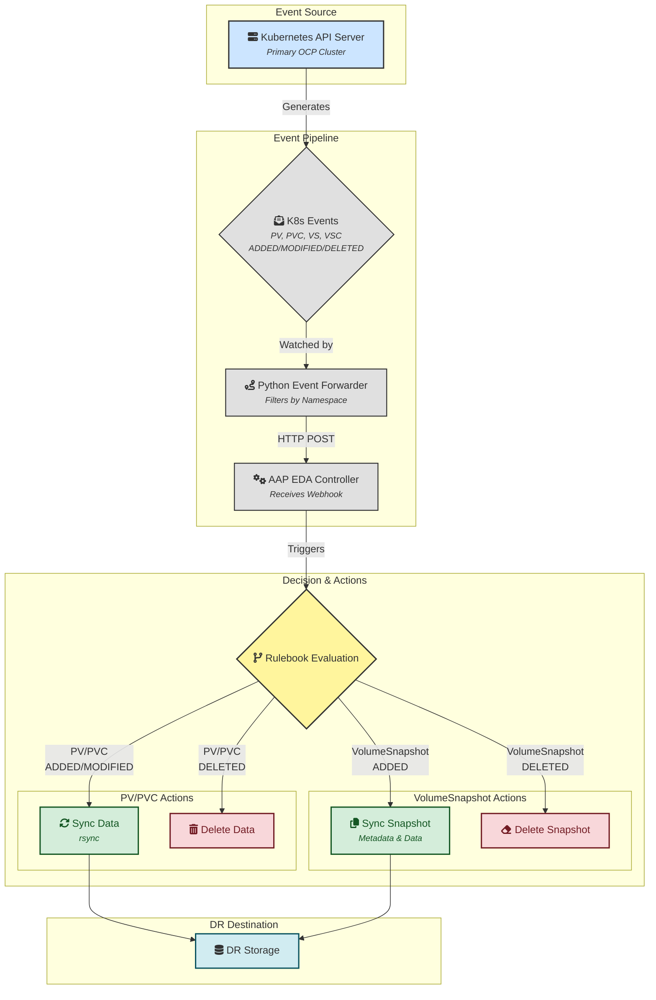
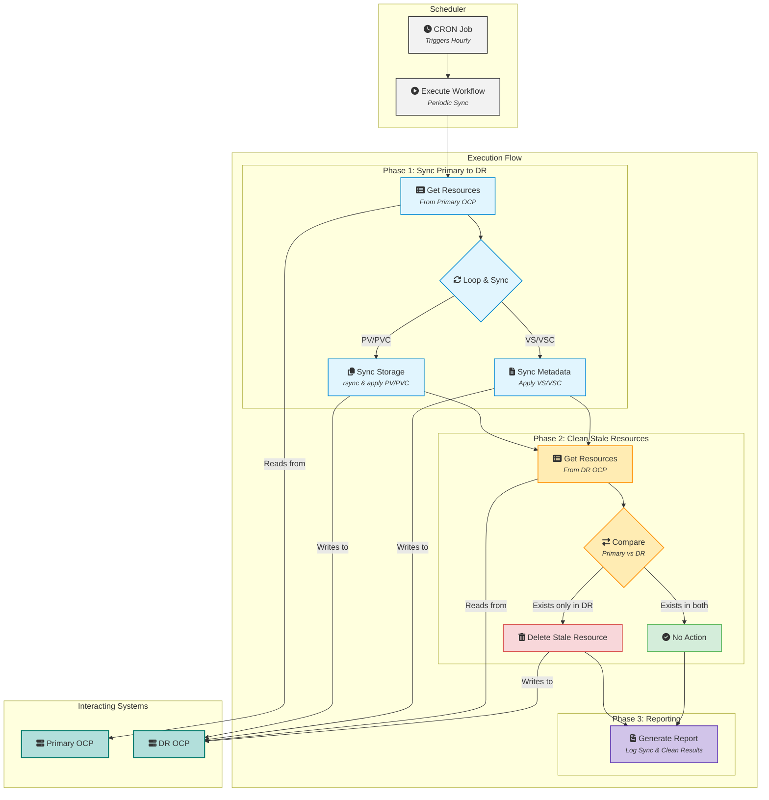
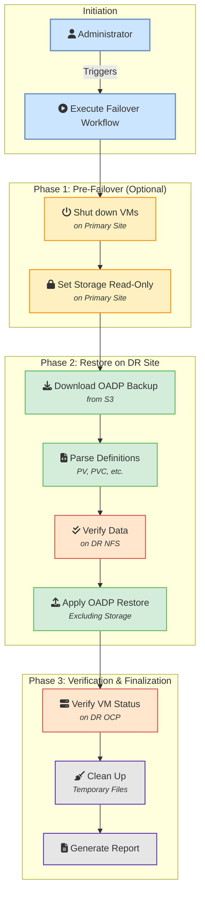

### 项目名称：OCP-V 事件驱动灾备自动化项目

### **1. 项目目标与三模架构**

目标：  
本项目旨在构建一个三模式、高度自动化的 OCP-V 灾备解决方案。它结合了事件驱动的实时同步、周期性的主动校验和手动触发的灾备恢复能力，以实现数据近实时同步、最终一致性保障和一键式灾备切换。  
**三模架构：**

1. **模式一：事件驱动的实时数据复制 (Event-Driven Replication)**  
   * **核心**：AAP Event-Driven Ansible (EDA) Controller。  
   * **目标**：通过监听主 OpenShift 集群中指定命名空间内的 PV (PersistentVolume), PVC (PersistentVolumeClaim), VolumeSnapshot, 和 VolumeSnapshotContent 事件，自动、实时地将底层存储数据和相关元数据同步到灾备站点。此模式响应速度最快，是数据同步的主要手段。
2. **模式二：周期性的主动同步 (Scheduled Proactive Sync)**
   * **核心**：AAP Workflow Scheduler。
   * **目标**：定时（例如每小时）对主站点指定命名空间内的所有 PV, PVC, VolumeSnapshot, 和 VolumeSnapshotContent 进行全面扫描和同步，作为事件驱动模式的补充和校验，确保数据最终一致性，防止因事件丢失导致的数据差异。**同时，该模式会比较主站点与灾备站点的资源，并删除在灾备站点上存在但在主站点上已被删除的资源，确保灾备环境的精确镜像。**
3. **模式三：手动触发的灾备恢复 (Manual Failover)**  
   * **核心**：AAP Workflow。  
   * **目标**：在发生灾难时，由管理员手动触发一个标准化的工作流，在灾备站点重建存储并恢复应用服务。

### **2. 核心理念与自动化架构**

**自动化架构图：**

**模式一: 事件驱动的实时复制 (Event-Driven Replication)**


**模式二: 周期性的主动同步 (Scheduled Proactive Sync)**


**模式三: 手动灾备恢复 (Manual Failover)**


### **3\. Ansible 项目结构设计 (架构更新)**

为了支持多种 `StorageClass` 并将 PV/PVC 与 VolumeSnapshot 的处理逻辑解耦，项目结构更新如下：

```
ocp-v-dr-automation/
├── inventory/
│   └── hosts.ini
├── group_vars/
│   └── all.yml
├── rulebooks/
│   └── ocp_dr_events.yml         # EDA 规则手册，统一监听事件
├── roles/
│   ├── event_pv_pvc_sync/        # 角色: (事件驱动) 处理 PV/PVC 创建/更新
│   │   └── tasks/
│   │       ├── main.yml          # -> 根据 storageClassName 分发
│   │       ├── handle_nfs_subdir.yml
│   │       ├── handle_nfs_dynamic.yml
│   │       └── handle_nfs_csi.yml
│   ├── event_pv_pvc_delete/      # 角色: (事件驱动) 处理 PV/PVC 删除
│   │   └── tasks/
│   │       ├── main.yml          # -> 根据 storageClassName 分发
│   │       ├── handle_nfs_subdir.yml
│   │       ├── handle_nfs_dynamic.yml
│   │       └── handle_nfs_csi.yml
│   ├── event_snapshot_sync/      # 角色: (事件驱动) 处理快照创建/更新
│   ├── event_snapshot_delete/    # 角色: (事件驱动) 处理快照删除
│   │
│   ├── periodic_pv_pvc_sync/     # 角色: (周期同步) 同步 PV/PVC
│   │   └── tasks/
│   │       ├── main.yml          # -> 遍历并根据 storageClassName 分发
│   │       ├── sync_nfs_subdir.yml
│   │       ├── sync_nfs_dynamic.yml
│   │       └── sync_nfs_csi.yml
│   ├── periodic_snapshot_sync/   # 角色: (周期同步) 同步快照
│   │
│   ├── oadp_backup_parser/       # 角色: (DR用) 解析OADP备份
│   ├── dr_storage_provisioner/   # 角色: (DR用) 在DR集群部署PV/PVC (按需)
│   └── oadp_restore_trigger/     # 角色: (DR用) 执行OADP恢复
│
└── playbooks/
    ├── event_driven/
    │   ├── handle_pv_pvc_sync.yml    # Playbook: (EDA) 调用 event_pv_pvc_sync
    │   ├── handle_pv_pvc_delete.yml  # Playbook: (EDA) 调用 event_pv_pvc_delete
    │   ├── handle_snapshot_sync.yml  # Playbook: (EDA) 调用 event_snapshot_sync
    │   └── handle_snapshot_delete.yml# Playbook: (EDA) 调用 event_snapshot_delete
    │
    ├── manual_dr/
    │   └── execute_failover.yml      # Playbook: (DR用) 执行完整的灾备切换
    │
    └── scheduled/
        └── execute_periodic_sync.yml # Playbook: (周期性) 依次调用 periodic_pv_pvc_sync 和 periodic_snapshot_sync
```
### **4. 模式一：事件驱动数据复制逻辑详解**

#### 4.1 OCP 事件转发与 Webhook 触发

* **实现方式**: 在主 OpenShift 集群上，通过一个定制的 **Python 事件转发器 (k8s_event_forwarder.py)** 来实现。
  * 该转发器作为一个 Deployment 运行在集群内部，使用 `in-cluster` Service Account 进行认证。
  * 容器镜像基于 Red Hat UBI 8 (`registry.access.redhat.com/ubi8/python-39`) 构建，确保了环境的稳定性和安全性。
  * **可配置的命名空间**: 转发器通过环境变量 (`WATCH_NAMESPACES`) 配置需要监视的命名空间列表。如果列表为空，则监视所有命名空间。
  * 它通过 `kubernetes` Python 客户端的 `watch` 功能，同时监视以下四种资源：
    * `PersistentVolume` (非命名空间绑定)
    * `PersistentVolumeClaim` (命名空间绑定)
    * `VolumeSnapshot` (命名空间绑定)
    * `VolumeSnapshotContent` (非命名空间绑定)
  * 当捕获到资源的 `ADDED`, `MODIFIED`, 或 `DELETED` 事件时，对于命名空间绑定的资源，它会检查资源是否属于被监视的命名空间。如果匹配，它会将事件封装成一个统一的 JSON 载荷（包含资源的 `namespace` 信息），通过 HTTP POST 请求发送到 AAP EDA Controller 上配置的 Webhook 地址。
* **触发条件**:
  * **PersistentVolume**: 监听 `v1.PersistentVolume` 资源的所有事件。
  * **PersistentVolumeClaim**: 监听指定命名空间下的 `v1.PersistentVolumeClaim` 资源事件。
  * **VolumeSnapshot**: 监听指定命名空间下的 `snapshot.storage.k8s.io/v1` 组的 `VolumeSnapshot` 资源事件。
  * **VolumeSnapshotContent**: 监听 `snapshot.storage.k8s.io/v1` 组的 `VolumeSnapshotContent` 资源事件。

#### 4.2 AAP EDA Rulebook 与逻辑分发

* **文件**: `rulebooks/ocp_dr_events.yml`
* **逻辑设计**:
  该规则手册通过 `ansible.eda.webhook` 监听来自 OCP 事件转发器的 HTTP POST 请求。它定义了一系列规则，用于根据事件的类型 (`ADDED`, `MODIFIED`, `DELETED`) 和资源类型 (`PersistentVolume`, `PersistentVolumeClaim`, `VolumeSnapshot`, `VolumeSnapshotContent`) 触发不同的 AAP 作业模板。
  - **核心变量**: `watched_namespaces` 用于定义需要监控的命名空间列表。
  - **规则分类**:
    - **非命名空间资源 (PV, VSC)**: 直接处理其创建、修改和删除事件。
    - **命名空间资源 (PVC, VS)**: 在处理事件前，会检查资源的命名空间是否在 `watched_namespaces` 列表中。
  - **触发动作**: 每个规则匹配成功后，会调用 `run_job_template` 动作，将事件中的资源对象 (`event.resource`) 作为 `extra_vars` 传递给相应的 AAP 作业模板（例如 "EDA - Sync PV to DR" 或 "EDA - Delete PVC from DR"），从而启动后续的同步或清理流程。
  - **快照特殊处理**: 对于 `VolumeSnapshot` 的创建事件，规则会额外检查 `status.readyToUse == true` 条件，确保只在快照可用时才触发同步。
* **对应的 Playbooks 和 Roles**:
  * **逻辑分离**: Playbook 层现在严格分离 PV/PVC 事件和 VolumeSnapshot 事件，调用不同的专用 Playbook。
  * **playbooks/event_driven/handle_pv_pvc_sync.yml**:
    1.  接收 AAP EDA 传递过来的 `resource_object` (PV 或 PVC)。
    2.  调用 `event_pv_pvc_sync` 角色进行处理。
    3.  **角色逻辑 (`event_pv_pvc_sync`)**:
        *   **核心**: 角色内部的 `main.yml` 会检查 `resource_object.spec.storageClassName`。
        *   使用 `include_tasks` 或类似机制，根据 `storageClassName` (例如 `nfs-subdir`, `nfs-dynamic`, `nfs-csi`) 调用对应的处理文件 (例如 `handle_nfs_subdir.yml`)。
        *   特定处理文件负责执行该存储类型的数据同步 (如 `rsync`) 和元数据处理。
  * **playbooks/event_driven/handle_pv_pvc_delete.yml**:
    1.  接收 `resource_object`。
    2.  调用 `event_pv_pvc_delete` 角色。
    3.  **角色逻辑 (`event_pv_pvc_delete`)**: 同样根据 `storageClassName` 进行分发，执行特定于存储的清理操作。
  * **playbooks/event_driven/handle_snapshot_sync.yml**:
    1.  接收 `resource_object` (VolumeSnapshot 或 VolumeSnapshotContent)。
    2.  调用 `event_snapshot_sync` 角色，该角色负责同步快照元数据。
  * **playbooks/event_driven/handle_snapshot_delete.yml**:
    1.  接收 `resource_object`。
    2.  调用 `event_snapshot_delete` 角色，负责清理快照元数据。

### **5\. 模式二：周期性主动同步逻辑详解**

此流程通过 AAP 的调度功能（Scheduler）定时触发，作为对事件驱动模式的补充和校验。**架构更新后，PV/PVC 的同步逻辑与 VolumeSnapshot 的同步逻辑被分离到不同的角色中，以实现更好的模块化和扩展性。**

*   **Playbook**: `playbooks/scheduled/execute_periodic_sync.yml`
*   **核心角色**: `roles/periodic_pv_pvc_sync`, `roles/periodic_snapshot_sync`
*   **关键变量**: Playbook 应通过变量 `target_namespaces` (例如 `['ns1', 'ns2']`) 来指定要同步的命名空间。

#### 5.1 获取所有相关资源
*   此步骤保持不变。Playbook 首先连接到主 OpenShift 集群 (`ocp_primary`)。
*   使用 `k8s_info` 模块，获取 `target_namespaces` 中所有的 `PersistentVolumeClaim` 和 `VolumeSnapshot` 列表。
*   同时获取所有相关的 `PersistentVolume` 和 `VolumeSnapshotContent` 列表。

#### 5.2 周期性同步 PVC/PV (Warm Standby)
*   **Playbook 逻辑**: 主 Playbook (`execute_periodic_sync.yml`) 调用 `periodic_pv_pvc_sync` 角色，并将获取到的 PV 和 PVC 列表作为参数传递。
*   **角色逻辑 (`periodic_pv_pvc_sync`)**:
    *   **输入**: `all_pvs_to_sync` 和 `all_pvcs_to_sync` 列表。
    *   **模块化处理**: 角色 `main.yml` 循环遍历所有 PVC，并通过 `include_tasks: sync_one_pvc.yml` 将每个 PVC 的处理委托给一个独立的任务文件。
    *   **核心逻辑 (`sync_one_pvc.yml`)**:
        *   对于单个 PVC，此文件会查找其绑定的 PV，并确定 `storageClassName`。
        *   根据 `storageClassName`，使用 `include_tasks` 调用特定于该存储类型的同步逻辑文件（例如 `sync_nfs_subdir.yml`, `sync_nfs_dynamic.yml`, `sync_nfs_csi.yml`）。
    *   **特定存储逻辑 (以 `sync_nfs_*.yml` 为例)**:
        1.  **数据同步**: `delegate_to` 到主存储服务器，执行 `rsync` 将数据同步到灾备存储服务器。
        2.  **修改 PV 定义**: 在内存中修改 PV 定义，使其指向灾备存储服务器的路径和地址。同时，将 `persistentVolumeReclaimPolicy` 强制设置为 `Retain`。
        3.  **清理元数据**: 在应用到灾备集群前，清理 PV 和 PVC 对象中特定于源集群的元数据（如 `resourceVersion`, `uid`, `claimRef` 等）。
        4.  **应用到灾备集群**: 使用 `kubernetes.core.k8s` 模块将清理和修改后的 PV 和 PVC 定义 `apply` 到灾备集群。
    *   **记录日志**: 记录每个 PV 和 PVC 的同步状态。

#### 5.3 周期性同步 VolumeSnapshot/VolumeSnapshotContent
*   **Playbook 逻辑**: 在 PV/PVC 同步完成后，主 Playbook 调用 `periodic_snapshot_sync` 角色，并将获取到的 VolumeSnapshot 和 VolumeSnapshotContent 列表作为参数传递。
*   **角色逻辑 (`periodic_snapshot_sync`)**:
    *   **输入**: `all_snapshots_to_sync` 和 `all_vscs_to_sync` 列表。
    *   **模块化处理**: 角色 `main.yml` 循环遍历所有 `readyToUse` 的 VolumeSnapshot，并通过 `include_tasks: sync_one_snapshot.yml` 将每个快照的处理委托给一个独立的任务文件。
    *   **核心逻辑 (`sync_one_snapshot.yml`)**:
        1.  **查找 VSC**: 找到与 VolumeSnapshot 绑定的 VolumeSnapshotContent。
        2.  **清理元数据**: 分别清理 VolumeSnapshot 和 VolumeSnapshotContent 对象中特定于源集群的元数据（如 `resourceVersion`, `uid`, `status` 等）。
        3.  **应用到灾备集群**: 使用 `kubernetes.core.k8s` 模块将清理后的定义 `apply` 到灾备集群。
    *   **数据同步说明**: 此角色专注于元数据同步。快照的底层数据假定由存储层复制机制或带 `rsync` 的自定义逻辑处理。

#### 5.4 清理灾备站点多余资源
*   此逻辑在主 Playbook 的最后执行，保持不变。
*   它会分别获取灾备站点的 PV/PVC 和 VolumeSnapshot/VSC 列表。
*   与主站点的资源列表进行比较，并删除在灾备站点上多余的资源。

#### 5.5 生成报告
*   此步骤保持不变，在 Playbook 的最后汇总所有操作结果并生成报告。

### **6. 模式三：手动灾备恢复逻辑详解**

此流程由管理员在灾难发生后，通过 AAP 手动启动一个 Workflow Template 来执行。

#### 6.1 灾备切换前置操作 (主站点)

*   **目标**: 在主站点发生故障或计划性切换时，确保数据一致性并准备进行灾备恢复。
*   **实现方式**: 作为 `manual_dr/execute_failover.yml` Playbook 的初始步骤。
*   **角色/任务**:
    1.  **关闭主站点相关虚拟机**:
        *   连接到主 OpenShift 集群 (ocp\_primary)。
        *   识别需要保护的命名空间中的所有虚拟机。
        *   执行 `oc delete vm <vm-name> -n <namespace>` 或 `oc patch vm <vm-name> -p '{"spec":{"running":false}}' --type=merge` 来关闭虚拟机。
    2.  **（可选）设置主存储为只读**:
        *   对于 NFS 场景，连接到主 NFS 服务器。
        *   修改 NFS 导出配置，将相关路径设置为只读，防止进一步写入。
        *   **注意**: 此步骤需根据实际存储类型和自动化能力进行调整。

#### 6.2 查找并解析备份

*   **角色: oadp_backup_parser**
    1.  **输入**: 由 AAP 调查问卷（Survey）提供要恢复的 `backup_name` (如果为空，则自动查找最新的) 和 `namespace`。
    2.  在 `localhost` 上执行。
    3.  从 S3 下载指定的 OADP 备份包。
    4.  解压并解析，提取所有 PV, PVC, VolumeSnapshot, 和 VolumeSnapshotContent 的 JSON 定义，形成 `pv_info_list`, `pvc_info_list`, `vs_info_list`, `vsc_info_list` 变量。
    5.  **输出**: 包含所有已解析资源定义的列表变量。

#### 6.3 存储逻辑分发与验证

*   **Playbook 内部逻辑**:
    1.  **输入**: `oadp_backup_parser` 角色输出的 `pv_info_list`。
    2.  **核心：存储逻辑分发**: Playbook 会遍历 `pv_info_list`。对于列表中的每一个 PV 对象，它会检查 `item.spec.storageClassName`。
    3.  **动态调用验证任务**: 根据 `storageClassName`，Playbook 会动态地 `include_tasks` 一个特定于该存储类型的验证任务文件。例如，如果 `storageClassName` 是 `nfs-dynamic`，它会调用 `verify_nfs_dynamic.yml`。对于 `nfs-csi` 也会有对应的 `verify_nfs_csi.yml`。
    4.  **特定存储验证 (以 NFS 为例)**:
        *   **目标**: 验证灾备端的数据是否就绪。
        *   **操作**: `delegate_to` 到灾备 NFS 服务器 (`dr_nfs_server`)。
        *   根据 PV 定义中的路径信息，检查灾备 NFS 服务器上对应的目录是否存在且非空。
        *   此步骤是验证，而不是同步。如果验证失败，则会记录严重警告或中止流程，表明周期性同步存在问题，灾备数据不可靠。

#### 6.4 在 DR OCP 上恢复应用

*   **角色: oadp_restore_trigger**
    1.  **输入**: `backup_name`。
    2.  连接到灾备 OCP 集群 (`ocp_dr`)。
    3.  动态生成 Restore 对象，`spec.backupName` 设置为输入的 `backup_name`，并且 `excludedResources` 必须包含 `persistentvolumes`, `persistentvolumeclaims`, `volumesnapshots`, `volumesnapshotcontents`。
    4.  `apply` 这个 Restore 对象，并轮询 VM 状态直到成功。

#### 6.5 灾备恢复后验证与清理

*   **目标**: 确认灾备恢复成功，并执行必要的清理工作。
*   **实现方式**: 作为 `manual_dr/execute_failover.yml` Playbook 的后续步骤。
*   **角色/任务**:
    1.  **验证虚拟机状态**:
        *   连接到灾备 OpenShift 集群 (`ocp_dr`)。
        *   检查恢复的虚拟机是否处于 `Running` 状态。
        *   可以尝试连接到虚拟机内部，验证应用服务是否正常启动。
    2.  **清理临时文件**:
        *   删除 `oadp_backup_parser` 角色下载和解压的临时备份文件。
    3.  **生成报告**:
        *   记录灾备切换的时间、持续时间、成功或失败状态以及任何关键信息。

### **7. AAP 平台配置**

1. **EDA Controller 配置**:  
   * 创建一个项目（Project）指向包含 rulebooks/ 目录的 Git 仓库。  
   * 配置一个 Decision Environment（通常使用默认的）。  
   * 创建一个 Rulebook Activation，关联项目和 ocp_dr_events.yml 规则手册，并启动它。  
   * **重要**: 在 Rulebook Activation 中，需要将 Webhook 的 URL 和认证 Token 作为环境变量传递给 `k8s_event_forwarder.py` 的 Deployment。
2. **Workflow 与调度配置**:  
   * **事件驱动 Job Templates**: 创建 Job Template，分别对应 EDA 触发的 `handle_nfs_pv_sync.yml`, `handle_nfs_pv_delete.yml` 等 Playbook。
   * **周期性同步 Job Template**: 创建一个 Job Template，关联 `scheduled/execute_periodic_sync.yml` Playbook。
     * 在此 Job Template 上配置一个 **Schedule**，设置 CRON 表达式（例如 `0 * * * *` 表示每小时执行一次）。
   * **手动恢复 Workflow Template**: 创建一个 "一键灾备切换" Workflow Template，关联 `manual_dr/execute_failover.yml` Playbook，并配置调查问卷以接收 `backup_name`。

通过此番设计，您的灾备方案将提升到一个新的水平，实现了数据同步的自动化和实时性，通过周期性校验保障了最终一致性，同时保留了灾备恢复过程的严谨性和可控性。
