### 项目名称：OCP-V 事件驱动灾备自动化项目

### **1. 项目目标与三模架构**

目标：  
本项目旨在构建一个三模式、高度自动化的 OCP-V 灾备解决方案。它结合了事件驱动的实时同步、周期性的主动校验和手动触发的灾备恢复能力，以实现数据近实时同步、最终一致性保障和一键式灾备切换。  
**三模架构：**

1. **模式一：事件驱动的实时数据复制 (Event-Driven Replication)**  
   * **核心**：AAP Event-Driven Ansible (EDA) Controller。  
   * **目标**：通过监听主 OpenShift 集群中指定命名空间内的 PV (PersistentVolume), PVC (PersistentVolumeClaim), VolumeSnapshot, 和 VolumeSnapshotContent 事件，自动、实时地将底层存储数据和相关元数据同步到灾备站点。此模式响应速度最快，是数据同步的主要手段。
2. **模式二：周期性的主动同步 (Scheduled Proactive Sync)**
   * **核心**：AAP Workflow Scheduler。
   * **目标**：定时（例如每小时）对主站点指定命名空间内的所有 PV, PVC, VolumeSnapshot, 和 VolumeSnapshotContent 进行全面扫描和同步，作为事件驱动模式的补充和校验，确保数据最终一致性，防止因事件丢失导致的数据差异。
3. **模式三：手动触发的灾备恢复 (Manual Failover)**  
   * **核心**：AAP Workflow。  
   * **目标**：在发生灾难时，由管理员手动触发一个标准化的工作流，在灾备站点重建存储并恢复应用服务。

### **2\. 核心理念与自动化架构**

**自动化架构图：**

**模式一: 事件驱动的实时复制 (Event-Driven Replication)**


**模式二: 周期性的主动同步 (Scheduled Proactive Sync)**

```mermaid
graph TD
    subgraph AAP Controller
        A[Scheduler<br>CRON Job] -- Triggers Hourly --> B[Execute Periodic Sync Workflow];
    end

    subgraph Ansible Execution
        B --> C[Playbook: execute_periodic_sync.yml<br>Vars: target_namespaces: 'ns1', 'ns2'];
        C --> D[Get All Resources<br>PV, PVC, VS, VSC<br>from specified namespaces];
        D --> E{Loop through each PV/PVC};
        E -- NFS based --> F[Role: periodic_storage_sync<br>1. rsync data to DR NFS<br>2. Modify PV spec for DR<br>3. Clean PV/PVC metadata<br>4. Apply PV/PVC to DR OCP];
        D --> G{Loop through each VS/VSC};
        G --> H[Role: periodic_storage_sync<br>Sync Snapshot Metadata & Data<br><b>Currently Skipped</b>];
        C --> I[Log Results & Generate Report];
    end

    subgraph "DR Infrastructure"
        F --> J[DR NFS Storage];
        F --> L[DR OCP Cluster];
        H --> K[DR Metadata Store];
    end

    style A fill:#e1e1e1,stroke:#333,stroke-width:2px
    style B fill:#e1e1e1,stroke:#333,stroke-width:2px
    style C fill:#e6f7ff,stroke:#333,stroke-width:2px
    style D fill:#e6f7ff,stroke:#333,stroke-width:2px
    style E fill:#e6f7ff,stroke:#333,stroke-width:2px
    style F fill:#e6f7ff,stroke:#333,stroke-width:2px
    style G fill:#e6f7ff,stroke:#333,stroke-width:2px
    style H fill:#e6f7ff,stroke:#333,stroke-width:2px
    style I fill:#e6f7ff,stroke:#333,stroke-width:2px
    style J fill:#d4edda,stroke:#333,stroke-width:2px
    style K fill:#d4edda,stroke:#333,stroke-width:2px
    style L fill:#d4edda,stroke:#333,stroke-width:2px
```


**模式三: 手动灾备恢复 (Manual Failover)**


### **3\. Ansible 项目结构设计 (集成 EDA)**
```
ocp-v-dr-automation/
├── inventory/
│   └── hosts.ini                 # 主机清单
├── group_vars/
│   ├── all.yml
│   └── ...
├── rulebooks/
│   └── ocp_dr_events.yml         # EDA 规则手册，监听PV和Snapshot事件
├── roles/
│   ├── nfs_sync_on_event/        # 角色: 响应PV创建/修改事件，执行rsync
│   ├── nfs_delete_on_event/      # 角色: 响应PV删除事件，删除远程目录
│   ├── snapshot_sync_on_event/   # 角色: 响应Snapshot创建事件，同步元数据
│   ├── snapshot_delete_on_event/ # 角色: 响应Snapshot删除事件，清理元数据
│   ├── oadp_backup_parser/       # 角色: (DR用) 解析OADP备份
│   ├── dr_storage_provisioner/   # 角色: (DR用) 在DR集群部署PV/PVC
│   ├── oadp_restore_trigger/     # 角色: (DR用) 执行OADP恢复
│   └── periodic_storage_sync/    # 角色: (周期性任务用) 遍历并同步所有存储资源
└── playbooks/
    ├── event_driven/
    │   ├── handle_nfs_pv_sync.yml    # Playbook: (EDA用) 调用nfs_sync_on_event
    │   ├── handle_nfs_pv_delete.yml  # Playbook: (EDA用) 调用nfs_delete_on_event
    │   ├── handle_snapshot_sync.yml  # Playbook: (EDA用) 调用snapshot_sync_on_event
    │   └── handle_snapshot_delete.yml# Playbook: (EDA用) 调用snapshot_delete_on_event
    ├── manual_dr/
    │   └── execute_failover.yml      # Playbook: (DR用) 执行完整的灾备切换
    └── scheduled/
        └── execute_periodic_sync.yml # Playbook: (周期性任务用) 执行完整的周期性同步
```
### **4\. 模式一：事件驱动数据复制逻辑详解**

#### 流程 1-2: OCP 事件转发与 Webhook 触发

* **实现方式**: 在主 OpenShift 集群上，通过一个定制的 **Python 事件转发器 (k8s_event_forwarder.py)** 来实现。
  * 该转发器作为一个 Deployment 运行在集群内部，使用 `in-cluster` Service Account 进行认证。
  * **可配置的命名空间**: 转发器通过环境变量 (`WATCH_NAMESPACES`) 配置需要监视的命名空间列表。如果列表为空，则监视所有命名空间。
  * 它通过 `kubernetes` Python 客户端的 `watch` 功能，同时监视以下四种资源：
    * `PersistentVolume` (非命名空间绑定)
    * `PersistentVolumeClaim` (命名空间绑定)
    * `VolumeSnapshot` (命名空间绑定)
    * `VolumeSnapshotContent` (非命名空间绑定)
  * 当捕获到资源的 `ADDED`, `MODIFIED`, 或 `DELETED` 事件时，对于命名空间绑定的资源，它会检查资源是否属于被监视的命名空间。如果匹配，它会将事件封装成一个统一的 JSON 载荷（包含资源的 `namespace` 信息），通过 HTTP POST 请求发送到 AAP EDA Controller 上配置的 Webhook 地址。
* **触发条件**:
  * **PersistentVolume**: 监听 `v1.PersistentVolume` 资源的所有事件。
  * **PersistentVolumeClaim**: 监听指定命名空间下的 `v1.PersistentVolumeClaim` 资源事件。
  * **VolumeSnapshot**: 监听指定命名空间下的 `snapshot.storage.k8s.io/v1` 组的 `VolumeSnapshot` 资源事件。
  * **VolumeSnapshotContent**: 监听 `snapshot.storage.k8s.io/v1` 组的 `VolumeSnapshotContent` 资源事件。

#### 流程 3-4: AAP EDA Rulebook 与逻辑分发

* **文件**: rulebooks/ocp_dr_events.yml  
* **逻辑设计**:
```yaml
---
- name: Process OCP DR Events from Webhook
  hosts: localhost
  sources:
    - ansible.eda.webhook:
        host: 0.0.0.0
        port: 5000
        # 在 AAP 中，需要配置 token 来保护此 webhook
        # token: "{{ eda_webhook_token }}"

  vars:
    # 定义需要同步的命名空间列表，可以从外部注入
    watched_namespaces:
      - "app-ns1"
      - "app-ns2"

  rules:
    # 规则 1: 处理 PV 的创建和修改 (非命名空间资源)
    - name: Handle PV Create or Update
      condition: >
        event.kind == "PersistentVolume" and
        (event.type == "ADDED" or event.type == "MODIFIED")
      action:
        run_job_template:
          name: "EDA - Sync PV to DR"
          organization: "Default"
          job_args:
            extra_vars:
              resource_object: "{{ event.resource }}"

    # 规则 2: 处理 PV 的删除 (非命名空间资源)
    - name: Handle PV Deletion
      condition: >
        event.kind == "PersistentVolume" and
        event.type == "DELETED"
      action:
        run_job_template:
          name: "EDA - Delete PV from DR"
          organization: "Default"
          job_args:
            extra_vars:
              resource_object: "{{ event.resource }}"

    # 规则 3: 处理受监控命名空间中 PVC 的创建和修改
    - name: Handle PVC Create or Update in Watched Namespaces
      condition: >
        event.kind == "PersistentVolumeClaim" and
        (event.type == "ADDED" or event.type == "MODIFIED") and
        event.resource.metadata.namespace in watched_namespaces
      action:
        run_job_template:
          name: "EDA - Sync PVC to DR"
          organization: "Default"
          job_args:
            extra_vars:
              resource_object: "{{ event.resource }}"

    # 规则 4: 处理受监控命名空间中 PVC 的删除
    - name: Handle PVC Deletion in Watched Namespaces
      condition: >
        event.kind == "PersistentVolumeClaim" and
        event.type == "DELETED" and
        event.resource.metadata.namespace in watched_namespaces
      action:
        run_job_template:
          name: "EDA - Delete PVC from DR"
          organization: "Default"
          job_args:
            extra_vars:
              resource_object: "{{ event.resource }}"

    # 规则 5: 处理受监控命名空间中 VolumeSnapshot 的创建
    - name: Handle VolumeSnapshot Creation in Watched Namespaces
      condition: >
        event.kind == "VolumeSnapshot" and
        event.type == "ADDED" and
        event.resource.metadata.namespace in watched_namespaces and
        event.resource.status.readyToUse == true
      action:
        run_job_template:
          name: "EDA - Sync VolumeSnapshot Metadata"
          organization: "Default"
          job_args:
            extra_vars:
              resource_object: "{{ event.resource }}"

    # 规则 6: 处理受监控命名空间中 VolumeSnapshot 的删除
    - name: Handle VolumeSnapshot Deletion in Watched Namespaces
      condition: >
        event.kind == "VolumeSnapshot" and
        event.type == "DELETED" and
        event.resource.metadata.namespace in watched_namespaces
      action:
        run_job_template:
          name: "EDA - Delete VolumeSnapshot Metadata"
          organization: "Default"
          job_args:
            extra_vars:
              resource_object: "{{ event.resource }}"

    # 规则 7: 处理 VolumeSnapshotContent 的创建和修改 (非命名空间资源)
    - name: Handle VolumeSnapshotContent Create or Update
      condition: >
        event.kind == "VolumeSnapshotContent" and
        (event.type == "ADDED" or event.type == "MODIFIED")
      action:
        run_job_template:
          name: "EDA - Sync VSC Metadata"
          organization: "Default"
          job_args:
            extra_vars:
              resource_object: "{{ event.resource }}"

    # 规则 8: 处理 VolumeSnapshotContent 的删除 (非命名空间资源)
    - name: Handle VolumeSnapshotContent Deletion
      condition: >
        event.kind == "VolumeSnapshotContent" and
        event.type == "DELETED"
      action:
        run_job_template:
          name: "EDA - Delete VSC Metadata"
          organization: "Default"
          job_args:
            extra_vars:
              resource_object: "{{ event.resource }}"
```
* **对应的 Playbooks**:
  * Playbook 现在应该更加通用，以处理不同类型的资源对象。例如，可以有一个通用的 `handle_resource_sync.yml` 和 `handle_resource_delete.yml`，它们接收 `resource_object` 变量，并根据 `resource_object.kind` 来调用不同的角色或执行不同的逻辑。
  * **playbooks/event_driven/handle_resource_sync.yml**:
    1. 接收 AAP EDA 传递过来的 `resource_object` 变量。
    2. 根据 `resource_object.kind` (e.g., "PersistentVolume", "PersistentVolumeClaim") 调用相应的同步角色。
    3. 角色逻辑：解析传入的 `resource_object`，执行数据和元数据同步。
  * **playbooks/event_driven/handle_resource_delete.yml**:
    1. 接收 `resource_object` 变量。
    2. 根据 `resource_object.kind` 调用相应的删除角色。
    3. 角色逻辑：解析传入的 `resource_object`，在灾备端执行清理操作。

### **5\. 模式二：周期性主动同步逻辑详解**

此流程通过 AAP 的调度功能（Scheduler）定时触发，例如每小时执行一次，作为对事件驱动模式的补充和校验。

*   **Playbook**: `playbooks/scheduled/execute_periodic_sync.yml`
*   **核心角色**: `roles/periodic_storage_sync`
*   **关键变量**: Playbook 应通过变量 `target_namespaces` (例如 `['ns1', 'ns2']`) 来指定要同步的命名空间。

#### **流程详解**:

1.  **获取所有相关资源**:
    *   连接到主 OpenShift 集群 (`ocp_primary`)。
    *   使用 `k8s_info` 模块，遍历 `target_namespaces` 列表，获取每个命名空间下的 `PersistentVolumeClaim` 和 `VolumeSnapshot` 列表。
    *   使用 `k8s_info` 模块获取所有相关的 `PersistentVolume` 和 `VolumeSnapshotContent` 列表（这些是非命名空间资源，但可以通过关联的 PVC 和 VolumeSnapshot 进行筛选）。

2.  **遍历并同步 PVC/PV (Warm Standby)**:
    *   在 Playbook 中，使用 `loop` 循环遍历获取到的 PVC 列表。
    *   对于每一个 PVC，找到其绑定的 PV (`spec.volumeName`)。
    *   调用 `periodic_storage_sync` 角色，传入 PVC 和 PV 对象。
    *   **角色逻辑 (`periodic_storage_sync`)**:
        *   **输入**: `pvc_object` 和 `pv_object`。
        *   **第一步：数据同步**: `delegate_to` 到主 NFS 服务器，执行 `rsync` 将数据同步到灾备 NFS 服务器。**注意**: 此操作要求主 NFS 服务器 (`primary_nfs_server`) 与灾备 NFS 服务器 (`dr_nfs_server`) 之间已配置好基于密钥的 SSH 免密登录。
        *   **第二步：修改 PV 定义**: 在内存中修改 `pv_object` 的定义，将其 `spec.nfs.server` 指向灾备 NFS 服务器 (`dr_nfs_server`)。同时，将 `spec.persistentVolumeReclaimPolicy` 强制设置为 `Retain`，以防止在灾备端因找不到删除插件而导致 PV 状态失败。
        *   **第三步：清理并应用 PV/PVC**:
            *   **清理元数据**: 在应用到灾备集群前，必须清理 PV 和 PVC 对象中特定于源集群的元数据。这包括 `metadata.resourceVersion`, `metadata.uid`, `metadata.creationTimestamp`, `metadata.annotations`, `status` 字段，以及 PV 中的 `spec.claimRef`。移除 `claimRef` 是为了让灾备端的 PV 能够被新的 PVC 绑定。
            *   **应用到灾备集群**: 使用 `kubernetes.core.k8s` 模块，通过 `ocp_dr_api_server` 和 `ocp_dr_api_key` 变量连接到灾备 OpenShift 集群 (`ocp_dr`)，然后将清理并修改后的 PV 定义以及清理后的 PVC 定义 `apply` 到该集群。
        *   **记录日志**: 记录每个 PV 和 PVC 在灾备集群上的部署状态。
        *   **注意**: 这种 "Warm Standby" 模式意味着存储资源在灾备端是预先创建好的，从而缩短了恢复时间。

3.  **遍历并同步 VolumeSnapshot/VolumeSnapshotContent**:
    *   **注意**: 当前版本的实现暂时跳过了此部分功能，以集中关注 PV 和 PVC 的同步。以下为原设计逻辑，将在未来版本中恢复。
    *   同样使用 `loop` 循环遍历获取到的 `VolumeSnapshot` 列表。
    *   对于每一个 VolumeSnapshot，找到其绑定的 `VolumeSnapshotContent` (`status.boundVolumeSnapshotContentName`)。
    *   调用 `periodic_storage_sync` 角色（或专门的角色），传入 VS 和 VSC 对象。
    *   **角色逻辑**:
        *   **输入**: `snapshot_object` 和 `content_object`。
        *   **同步元数据**: 将 VS 和 VSC 的定义同步到灾备端的元数据存储。
        *   **同步快照数据**: 根据 `content_object.spec.source` 确定快照数据的位置并执行同步。

4.  **生成报告**:
    *   在 Playbook 的最后，汇总所有资源的同步结果。
    *   生成一个简明的报告，指出哪些资源同步成功，哪些失败，以及发现的数据不一致情况。此报告可以通过邮件、Webhook 等方式通知管理员。

### **6\. 模式三：手动灾备恢复逻辑详解**

此流程由管理员在灾难发生后，通过 AAP 手动启动一个 Workflow Template 来执行。

#### 流程 0: 灾备切换前置操作 (主站点)

*   **目标**: 在主站点发生故障或计划性切换时，确保数据一致性并准备进行灾备恢复。
*   **实现方式**: 作为 `manual_dr/execute_failover.yml` Playbook 的初始步骤。
*   **角色/任务**:
    1.  **关闭主站点相关虚拟机**:
        *   连接到主 OpenShift 集群 (ocp\_primary)。
        *   识别需要保护的命名空间中的所有虚拟机。
        *   执行 `oc delete vm <vm-name> -n <namespace>` 或 `oc patch vm <vm-name> -p '{"spec":{"running":false}}' --type=merge` 来关闭虚拟机。
    2.  **（可选）设置主存储为只读**:
        *   对于 NFS 场景，连接到主 NFS 服务器。
        *   修改 NFS 导出配置，将相关路径设置为只读，防止进一步写入。
        *   **注意**: 此步骤需根据实际存储类型和自动化能力进行调整。
    3.  **验证数据同步状态**:
        *   虽然 EDA 旨在实时同步，但在灾备切换前，执行最终的数据一致性检查（例如，对于 NFS，可以检查源和目标目录的大小或文件数量，可选基于校验码的验证）。

#### 流程 1-3: 查找并解析备份

*   **角色: oadp_backup_parser**
    1.  **输入**: 由 AAP 调查问卷（Survey）提供要恢复的 `backup_name` (如果为空，则自动查找最新的) 和 `namespace`。
    2.  在 `localhost` 上执行。
    3.  从 S3 下载指定的 OADP 备份包。
    4.  解压并解析，提取所有 PV, PVC, VolumeSnapshot, 和 VolumeSnapshotContent 的 JSON 定义，形成 `pv_info_list`, `pvc_info_list`, `vs_info_list`, `vsc_info_list` 变量。
    5.  **输出**: 包含所有已解析资源定义的列表变量。

#### 流程 4-5: 存储逻辑分发与验证 (NFS 场景)

*   **Playbook 内部逻辑**:
    1.  **输入**: 上一步输出的 `pv_info_list`。
    2.  **逻辑分发**: 使用 `when` 条件或 `include_role` 的 `when` 子句，根据 `item.spec.storageClassName` 来决定执行哪个存储类型的验证逻辑。
    3.  **NFS 验证**: **在灾备站点的 NFS 服务器上 (`delegate_to: dr_nfs_server`)** 执行最终数据同步。根据 `pv_info_list` 中的路径信息，构造 `rsync` 命令，将主 NFS 服务器的数据拉取到灾备 NFS 服务器。这是确保数据最终一致性的关键一步。
        *   **命令示例**: `rsync -av --delete user@primary-nfs:/path/to/data/ /path/to/dr/data/`
        *   **注意**: 此操作要求灾备 NFS 服务器 (`dr_nfs_server`) 与主 NFS 服务器 (`primary_nfs_server`) 之间已配置好基于密钥的 SSH 免密登录。
        *   在执行实际恢复前，可以先运行 `rsync --dry-run` 进行检查，如果不一致，可以打印警告信息。

#### 流程 6: 在 DR OCP 上部署存储

*   **角色: dr_storage_provisioner**
    1.  **输入**: `pv_info_list`, `pvc_info_list`, `vs_info_list`, `vsc_info_list`。
    2.  连接到灾备 OCP 集群 (`ocp_dr`)。
    3.  **恢复顺序至关重要**:
    4.  **第一步: 恢复 VolumeSnapshotContent 和 PV**:
        *   循环遍历 `vsc_info_list` 和 `pv_info_list`。
        *   **关键修改**: 更新 `vsc_object` 和 `pv_object` 中的存储后端细节（例如 NFS 服务器 IP 和路径）。
        *   将修改后的 VSC 和 PV 定义 `apply` 到灾备集群。
    5.  **第二步: 恢复 VolumeSnapshot 和 PVC**:
        *   循环遍历 `vs_info_list` 和 `pvc_info_list`。
        *   这些对象通常不需要修改，因为它们通过名称引用 VSC 和 PV。
        *   将它们 `apply` 到灾备集群的目标命名空间。

#### 7. 在 DR OCP 上恢复应用

*   **角色: oadp_restore_trigger**
    1.  **输入**: `backup_name`。
    2.  连接到灾备 OCP 集群 (`ocp_dr`)。
    3.  动态生成 Restore 对象，`spec.backupName` 设置为输入的 `backup_name`，并且 `excludedResources` 必须包含 `persistentvolumes`, `persistentvolumeclaims`, `volumesnapshots`, `volumesnapshotcontents`。
    4.  `apply` 这个 Restore 对象，并轮询 VM 状态直到成功。

#### 8. 灾备恢复后验证与清理

*   **目标**: 确认灾备恢复成功，并执行必要的清理工作。
*   **实现方式**: 作为 `manual_dr/execute_failover.yml` Playbook 的后续步骤。
*   **角色/任务**:
    1.  **验证虚拟机状态**:
        *   连接到灾备 OpenShift 集群 (`ocp_dr`)。
        *   检查恢复的虚拟机是否处于 `Running` 状态。
        *   可以尝试连接到虚拟机内部，验证应用服务是否正常启动。
    2.  **清理临时文件**:
        *   删除 `oadp_backup_parser` 角色下载和解压的临时备份文件。
    3.  **生成报告**:
        *   记录灾备切换的时间、持续时间、成功或失败状态以及任何关键信息。

### **7\. AAP 平台配置**

1. **EDA Controller 配置**:  
   * 创建一个项目（Project）指向包含 rulebooks/ 目录的 Git 仓库。  
   * 配置一个 Decision Environment（通常使用默认的）。  
   * 创建一个 Rulebook Activation，关联项目和 ocp_dr_events.yml 规则手册，并启动它。  
   * **重要**: 在 Rulebook Activation 中，需要将 Webhook 的 URL 和认证 Token 作为环境变量传递给 `k8s_event_forwarder.py` 的 Deployment。
2. **Workflow 与调度配置**:  
   * **事件驱动 Job Templates**: 创建 Job Template，分别对应 EDA 触发的 `handle_nfs_pv_sync.yml`, `handle_nfs_pv_delete.yml` 等 Playbook。
   * **周期性同步 Job Template**: 创建一个 Job Template，关联 `scheduled/execute_periodic_sync.yml` Playbook。
     * 在此 Job Template 上配置一个 **Schedule**，设置 CRON 表达式（例如 `0 * * * *` 表示每小时执行一次）。
   * **手动恢复 Workflow Template**: 创建一个 "一键灾备切换" Workflow Template，关联 `manual_dr/execute_failover.yml` Playbook，并配置调查问卷以接收 `backup_name`。

通过此番设计，您的灾备方案将提升到一个新的水平，实现了数据同步的自动化和实时性，通过周期性校验保障了最终一致性，同时保留了灾备恢复过程的严谨性和可控性。
